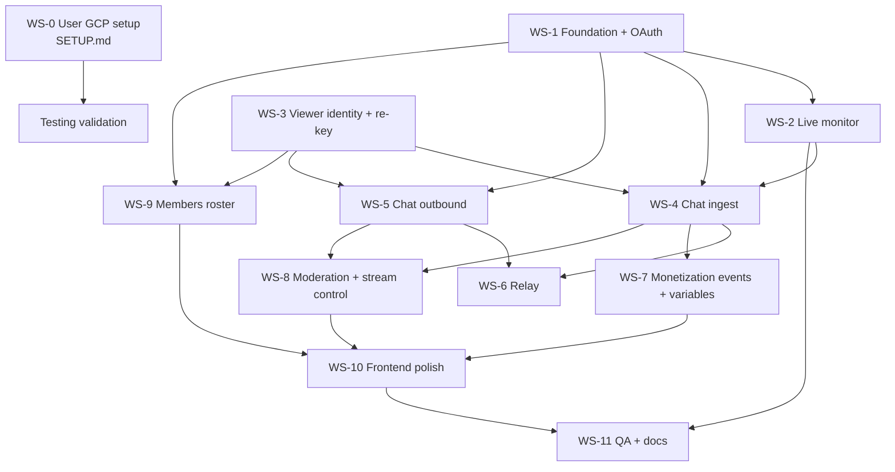

# Firebot × YouTube Integration — Build Plan

> **Single source of truth** for the fork adding native YouTube support to Firebot v5.
> Check off items as completed. Every workstream (WS) declares an **exclusive file
> ownership set** so parallel agents never write the same files.

## Status legend

- `[ ]` not started · `[~]` in progress · `[x]` done · `[!]` blocked (note why)
- Each WS header lists: **depends on**, **owns** (files that agent may write), **contract** (what others rely on).

## Ground rules for all agents

1. New code is **TypeScript**, styled per repo ESLint (`npm run lint` must pass; run `npx tsc --noEmit` for type sanity).
2. ALL YouTube code lives under `src/backend/integrations/builtin/youtube/` (unless a task explicitly says otherwise). Frontend additions live under `src/gui/app/` per-file ownership below.
3. **Never touch Twitch core files** except where a task explicitly lists them (dispatch refactors, compose box, chat menu gating).
4. YouTube module never imports `TwitchApi`. Communication between platform modules happens via the dispatch layer (WS-5) and exported EventEmitters only.
5. All YouTube backend logging: `LoggerCache.getLogger("YouTube")`.
6. Respect the **quota budget** in the invariants section — no polling loops without documented cost.
7. When a shared type is needed that doesn't exist yet, **don't create it silently** — check `# Contracts (WS-1 deliverable)` first; the contracts file owns shared types.

---

## Locked decisions (from planning session)

| # | Decision |
|---|---|
| D1 | Build as a **native integration** under `src/backend/integrations/builtin/youtube/` — not a second platform core, not a refactor of `AccountAccess`/`ConnectionManager` |
| D2 | **Two Google OAuth providers**: `youtube:streamer-account` + `youtube:bot-account`; bot account is a channel moderator |
| D3 | OAuth via existing `code`-flow machinery (`client-oauth2` → local HTTP callback `http://localhost:7472/api/v1/auth/callback`); Google params `access_type=offline&prompt=consent` embedded in authorizePath |
| D4 | Testing-mode consent screen (7-day refresh-token expiry accepted); production flip is a late checklist item |
| D5 | **Merged dashboard chat feed** (Twitch + YouTube in one feed), YT messages tagged with platform marker |
| D6 | **Cross-platform relay** (YT-bot relays Twitch→YT chat, Twitch-bot relays YT→Twitch): settings toggle (default **off**), only while *both* platforms live, per-minute cap (default 12), fixed `[Twitch] Name: message` / `[YT] Name: message` format, Twitch→YT **strips emote parts** |
| D7 | Command chat responses go to **both platforms** (Chat effect gains destination support), non-chat effects untouched |
| D8 | **Separate `youtube:*` event IDs** — no reuse of `twitch:*` event bindings |
| D9 | **Full viewer-DB re-key**: every viewer record `_id = "<platform>:<user_id>"` (`twitch:123`, `youtube:abc`), via a central identity helper; DB layers scope/unscope internally; all Twitch-facing surfaces keep carrying **raw** platform IDs; `FirebotChatMessage` gains `platform` field. No migration needed (fresh install), only a defensive sweep |
| D10 | Moderation parity for **delete/timeout/ban** (menu items work for YT messages); **mod/VIP grant + whisper are hidden** for YT messages (no API exists) |
| D11 | Title changes sync **both platforms** (`stream-title` effect + future manual edits); category stays Twitch-only (YT has no game taxonomy); polls deferred to roadmap |
| D12 | All monetization features built (member join/milestone/gifts, super chat/stickers, member roster best-effort w/ graceful 403) — events just won't fire until channel features are enabled |
| D13 | Live viewer panels ("Chat Users" list, Viewers page) are platform-aware; default variable set only |
| D14 | No cross-platform identity merging (same human, two records) — v2 problem |

---

## Key YouTube API facts (verified 2025-10, re-verify before relying)

- **Chat = REST polling.** `liveChatMessages.list` with `liveChatId`, `part=id,snippet,authorDetails`; every response has `nextPageToken`; wait `pollingIntervalMillis` (returned per response) before next call or expect `rateLimitExceeded`. `streamList` (server-streaming) exists as future upgrade — do NOT build on it for v1.
- **Send**: `liveChatMessages.insert` (costs **50 units/call**), `snippet.type=textMessageEvent`. YT display cap ~200 chars for regular chat.
- **Live detection**: `liveBroadcasts.list?mine=true&part=snippet,status,contentDetails` → `status.lifeCycleStatus` ∈ `live`/`testStarting`/`complete`; `snippet.liveChatId` + `id` (video id) cached. `offlineAt` on chat-list responses signals ended stream.
- **Moderation**: `liveChatMessages.delete` (owner/mod), `liveChatBans.insert` (`type: temporary` + `banDurationSeconds` 30s–86399s, or `type: permanent`), `liveChatBans.delete` (lift). Owner-or-mod OAuth required.
- **Per-message roles**: `authorDetails.isChatOwner / isChatModerator / isChatSponsor / isVerified` — no list API needed for role checks.
- **Monetization message types** arrive in the same chat feed: `newSponsorEvent`, `memberMilestoneChatEvent`, `membershipGiftingEvent`, `giftMembershipReceivedEvent`, `superChatEvent` (amountMicros/currency/tier/userComment), `superStickerEvent`. Roster: `members.list` + `membershipsLevels.list` (`youtube.channel-memberships.creator` scope, may 403 until YouTube approves the project post-enrollment).
- **Title update**: `liveBroadcasts.update` (or `videos.update`). YT "category" ≠ Twitch category (no game taxonomy).
- **Quota**: 10,000 units/day per project (fixed regardless of billing). List ops ≈1, inserts+moderation ≈50.

### Scopes

| Provider | Scopes |
|---|---|
| `youtube:streamer-account` | `https://www.googleapis.com/auth/youtube.force-ssl`, `https://www.googleapis.com/auth/youtube.channel-memberships.creator` |
| `youtube:bot-account` | `https://www.googleapis.com/auth/youtube.force-ssl` |

---

## Core invariants (non-negotiable, enforced in review)

1. **IDs**: `FirebotChatMessage.userId` and all event metadata `userId`s carry **raw platform IDs**. Scoping to `<platform>:<id>` happens **only** inside the DB layers via `viewers/viewer-identity.ts` (WS-3). One exception: YT-side DB calls must explicitly pass `platform: "youtube"`.
2. **Loop prevention** (relay + commands): all four logged-in identities (twitch streamer, twitch bot, yt streamer, yt bot) are filtered from every ingest path and from every relay source. Relay messages are authored by a bot account → `ignoreBot`-style command filtering must hold (verify command defaults during WS-4; add explicit relay-author filter belt-and-suspenders).
3. **Quota budget** per 24h (default 10k): live-check poll ≤1,440 (1/min while connected) + chat polls (~0.5–1 u/call at API-recommended interval, only while live) + inserts at 50 → budget a **bot-send cap of 80 messages/day** from effects by default (configurable), plus relay cap (D6). If tests blow the budget, tests are wrong.
4. **Chat reader lifecycle**: start only when broadcast is live; `nextPageToken` chain; `403 liveChatEnded`/`offlineAt` → clean stop + `stream-offline`; exponential backoff (max 3) on 5xx/network before giving up until next live-check.
5. **Token lifecycle**: refresh via `authManager.refreshTokenIfExpired()` before *every* connect call for BOTH accounts (integration-manager auto-refresh covers only the primary `auth` blob, not the bot token). On 401 after refresh → surface error to frontend + set integration disconnected.
6. `nextPageToken` persisted per session only (memory); a lost connection restarts history-free with fresh token + `maxResults=200`.

---

## Dependency graph



Sequential waves (minimum): **Wave 1** = WS-1 + WS-3 (parallel). **Wave 2** = WS-2 ∥ WS-4 ∥ WS-5 ∥ WS-7 ∥ WS-9. **Wave 3** = WS-6 ∥ WS-8. **Wave 4** = WS-10 → WS-11.

---

## Contracts (WS-1 deliverables — code against these, don't reinvent)

Agents building in parallel assume the following exist (defined first thing in WS-1, in
`src/backend/integrations/builtin/youtube/contracts.ts` + `youtube-api-client.ts`):

```ts
type YouTubePlatform = "youtube";

interface YouTubeChannelInfo { // from channels.list?part=snippet mine=true
    channelId: string;         // raw platform id (UC...)
    channelTitle: string;
    avatarUrl: string;
}

interface YouTubeAccountContext {
    providerId: string;              // "youtube:streamer-account" | "youtube:bot-account"
    channel: YouTubeChannelInfo;
    auth: AuthDetails;               // src/types/auth.ts
}

// Every YT message (chat or event) normalized to this before hitting Firebot core:
interface YouTubeIngestMessage {
    kind: "text" | "member-join" | "member-milestone" | "gift-membership"
        | "gift-membership-received" | "super-chat" | "super-sticker" | "banned";
    messageId: string;
    author: { channelId: string; displayName: string; avatarUrl: string;
              isOwner: boolean; isModerator: boolean; isSponsor: boolean };
    text?: string;
    publishedAt: string;             // ISO
    payload?: {                      // kind-specific
        superChatAmountDisplay?: string; superChatAmountMicros?: string;
        superChatCurrency?: string; superChatTier?: number;
        memberLevelName?: string; memberMonth?: number; isUpgrade?: boolean;
        giftCount?: number; gifterChannelId?: string;
    };
}
```

- `youtube-api-client.ts` — single REST façade. All methods take an explicit
  `account: "streamer" | "bot"` (token resolution + refresh inside). Methods (≥):
  `getMyChannel(account)`, `listOwnBroadcasts()`, `updateBroadcastTitle(videoId, title)`,
  `listChatMessages(liveChatId, pageToken?)`, `insertChatMessage(account, liveChatId, text)`,
  `deleteChatMessage(account, messageId)`, `banUser(account, liveChatId, channelId, {type, durationSecs})`,
  `unbanUser(account, bannedChannelId)`, `listChatModerators()` (via `listChatMessages` flags or `moderators.list` fallback),
  `listMembers()`, `listMembershipLevels()`, `getVideoLiveDetails(videoId)`. Returns typed results; throws `YouTubeApiError {kind: "quota"|"rate-limit"|"chat-ended"|"auth"|"not-found"|"other"}`.
- **Settings keys** (persisted via integration `settings-update`), pre-registered in WS-1 UI:
  `relayEnabled:false`, `relayMaxPerMinute:12`, `botAuth` (bot token storage), `botChannel` info, `linked:true/false`.
- **Emitters**: the integration exports `youtubeChatEvents: EventEmitter` with
  `"chat-message" (YouTubeIngestMessage)`, `"stream-online" (videoId,liveChatId)`,
  `"stream-offline"`, `"account-linked" (account)` — WS-2/4/6/8/9 subscribe, never import each other.

---

## WS-0 — User manual setup *(not agent work)*

- **Owns:** `SETUP.md` (user-maintained)
- [x] GCP project + OAuth client + consent-screen test users documented
- [x] Bot account → moderator documented
- [ ] *(user)* Execute SETUP.md §1–§3, paste `googleClientId`/`googleClientSecret` into `secrets.json`
- [ ] *(user, later)* Enrollment of Memberships (SETUP.md §5) — unblocks WS-9 real-data testing only

## WS-1 — Foundation: integration skeleton + Google OAuth (both accounts)

- **Depends on:** nothing (code-level)
- **Owns:** `src/backend/integrations/builtin/youtube/{youtube.js|youtube.ts, contracts.ts, youtube-api-client.ts, youtube-auth.ts, account-store.ts}`; `src/backend/integrations/builtin-integration-loader.js` (+1 line); `src/backend/secrets-manager.ts`; `src/gui/app/directives/modals/integrations/editIntegrationSettingsModal.js` (+template) for the new custom setting type; `secrets.template.json`
- **Contract out:** everything in the Contracts section; `secrets.googleClientId/googleClientSecret` read (NOT added to `expectedKeys` — missing keys must only *disable* the integration with a startup warning, never crash boot)

### Tasks
- [x] Add `googleClientId`/`googleClientSecret` to `FirebotSecrets` interface (optional) + `secrets.template.json`
- [x] Write `contracts.ts` with the types above + `YouTubeApiError` taxonomy
- [x] Loader line: register `youtube/youtube` in `builtin-integration-loader.js`
- [x] Integration definition: `id:"youtube", name:"YouTube", linkType:"auth", connectionToggle:true, configurable:true, authProviderDetails → streamer provider`
- [x] Auth providers (mirroring `twitch-auth.ts` shape, but `type:"code"` like Streamlabs):
  - [x] streamer: scopes `youtube.force-ssl` + `youtube.channel-memberships.creator`; `authorizeHost:"https://accounts.google.com"`, `authorizePath:"/o/oauth2/v2/auth?access_type=offline&prompt=consent"`, token `type:"code"`, `tokenHost:"https://oauth2.googleapis.com"`, `tokenPath:"/token"`, `redirectUriHost:"localhost"`, `autoRefreshToken: true`
  - [x] bot: scope `youtube.force-ssl` only; registered directly via `authManager.registerAuthProvider` in `init()` (NOT as `definition.authProviderDetails` — avoids auto-link confusion in `integration-manager.js`)
  - [!] Verify `client-oauth2` refresh works against Google (no `grant_type` surprises; scopes param tolerated) — blocked on WS-0: user's `secrets.json` GCP creds not installed yet; refresh flow is covered by unit tests against the client-oauth2 contract (Basic-auth header + `grant_type=refresh_token`) and needs one live re-approval test
- [x] `auth-success` handling:
  - [x] streamer → default integration-manager flow (link) + `link(linkData)` implementation: `getMyChannel("streamer")`, cache channel info, emit `settings-update`
  - [x] bot → integration-module-local listener: `authManager.on("auth-success", providerId === "youtube:bot-account")` → store `botAuth`+`botChannel` via `settings-update` mechanism
- [x] Bot link/unlink UI: custom setting type `"youtube-bot-auth"` rendered in integration settings modal — Link button → `shell.openExternal("http://localhost:{WebServerPort}/api/v1/auth?providerId=youtube:bot-account")` (mirror `startIntegrationLink`), status display (avatar+channel title), Unlink button
- [x] `account-store.ts`: typed accessors `getStreamerAccount()/getBotAccount()` returning `{channel, auth}` or null; token-expiry checks
- [x] `connect(integrationData)`: refresh-both-tokens, kick live monitor (WS-2 hook), set `connected=true` → emits framework `connected` event so Connection Panel tile works
- [x] `disconnect()`: stop monitor + chat (emitter hook points), `connected=false`
- [x] `unlink()`: clear all settings/auth (both accounts)
- [x] Graceful degradation: missing secrets → log + define but don't crash; definition exposes `linked:false`

### Acceptance
- [x] `npm run lint` + `npx tsc --noEmit` clean
- [ ] App boots with integration visible under Settings → Integrations, Link opens Google consent, both accounts can link, Connection Panel shows YouTube tile (disconnected state) — blocked on WS-0 secrets
- [ ] Kill + re-approval: weekly-expired tokens are refreshed transparently on connect — blocked on WS-0 secrets

### WS-1 notes (discovered during implementation)
- Test infra was unrunnable before this WS: `jest.config.ts` needs `ts-node`, jest needed `ts-jest` (transform) and `@types/jest` — all three added as devDependencies. Any agent running jest must run/npm-install once more. `tests/mocks/electron-mock.ts` (referenced by `jest.config.ts` moduleNameMapper) was created as a shared stub — extend it freely.
- Reusable test fixtures live in `src/backend/integrations/builtin/youtube/testing/google-api-fixtures.ts` (fake inline tokens/responses). NOTE: any `.ts` file directly under `__tests__/` is executed as a test suite by default testMatch — keep helpers/fixtures in `testing/`.
- `tests/mocks/electron-mock.ts` now stubs `app.getAppPath()` + `app.isPackaged` (data-access.ts reads both at module scope), so suites importing the data-access chain work under jest; extend it freely for other electron APIs.
- `integration-manager`'s `settings-update` listener sets `definition.linked = true` in memory for ANY settings persistence — so a bot-only link leaves the tile looking linked until restart (DB `/linked` flag is only written by `linkIntegration`). Also on reboot, a settings blob without the `linked` key reads back as linked (`!== false`). connect() guards this: no streamer token → emits `disconnected` and never connects.
- Bot unlink persists `botAuth:null`/`botChannel:null` via settings-update; bot link/unlink also push `youtube:bot-auth-update` ({linked, channel}) to the frontend for the open modal.
- `client-oauth2` token refresh sends Basic auth + `grant_type=refresh_token` (no scope param sent — auth-manager's `scopes` param is ignored by the lib's refresh body). Google accepts Basic-auth token refresh; verify on first live connect.
- Auth tokens (botAuth inside settings) do reach the frontend renderer inside `getAllIntegrationDefinitions.settings` — same exposure as other integrations (e.g. Streamlabs socketToken); acceptable for now, worth revisiting if tokens should move out of settings.
- Settings keys pre-registered: `relayEnabled:false`, `relayMaxPerMinute:12`, `botAuth`, `botChannel`, `streamerChannel`, `linked` (WS-6 consumes the relay pair; WS-2/4/5/9 should read tokens via account-store, not settings).

## WS-2 — Live broadcast monitor + stream online/offline events

- **Depends on:** WS-1 (contracts + client)
- **Owns:** `src/backend/integrations/builtin/youtube/live-monitor.ts`, `triggers/stream-events.ts`
- **Data out:** `"stream-online" (videoId, liveChatId, concurrentViewers?, startedAt?)`, `"stream-offline"` events; `frontendCommunicator.send("youtube:stream-info-update", {...})` for dashboard display (consumed in WS-10)

### Tasks
- [x] Poll loop (60s, only while integration connected): `listOwnBroadcasts()` → find `lifeCycleStatus === "live"` (accept `testStarting` as *pre-live* with no chat start) → cache `{videoId, liveChatId}`
- [x] Edge: multiple broadcasts (`mine=true` returns all) → pick most recent by (`status.recordings`? use `snippet.publishedAt` latest with live status) — **NOTE: WS-1 contract doesn't map `publishedAt`; recency key is `actualStartTime` (fallback `scheduledStartTime`)**
- [x] Transition live→offline (`lifeCycleStatus complete` OR `liveChatEnded` API error OR `offlineAt` in chat-list response): stop reader, fire `stream-offline` — monitor covers `complete` + broadcast-leaving-the-list + superseded; the `chat-ended` API-error leg belongs to WS-4's reader (stub locked below)
- [x] `videos.list(id, part=liveStreamingDetails,statistics)` piggyback for `concurrentViewers` (1 unit, same 60s tick) → `frontendCommunicator.send("youtube:stream-info-update", {...})` on payload change
- [x] `triggers/stream-events.ts`: fire `EventManager.triggerEvent("youtube", "stream-online"|"stream-offline", {username: channelTitle, userId: channelId, ...})`
- [x] Hook points into WS-1: `connect()` starts monitor; disconnect stops
- [x] Logging: every transition at info; poll errors at warn with error kind

### Acceptance
- [ ] With user's real channel: going live in YT Studio/OBS flips integration connected + fires both events (verify via Events test-fire + activity feed entry from WS-7 definitions) — blocked on WS-0 secrets
- [ ] Ending stream stops the chat reader (WS-4 hook) cleanly, no loop spam — monitor wiring done (stop on every offline transition); full verification pending WS-4

### WS-2 completion notes (for WS-4 / WS-7 / WS-10)
- **WS-4 HANDOFF — chat-ingest stub signatures (LOCKED):** `startChatIngest(liveChatId: string, videoId: string): void` / `stopChatIngest(): void`. The monitor calls `startChatIngest` once per broadcast going live (liveChatId = broadcast.liveChatId ?? videos.list `chatId` fallback) and `stopChatIngest()` on EVERY offline transition (complete, broadcast superseded, monitor stop). WS-4 keeps the signatures EXACTLY (arity asserted in `__tests__/chat-ingest.spec.ts`; monitor tests mock these functions) and implements the reader per invariants #4/#6 + the doc comment in the stub.
- Wiring choice: monitor drives the chat reader DIRECTLY via the stub import (not via subscribing to its own youtubeChatEvents) — simpler lifecycle, no listener-order dependence. `youtube.ts` side-effect-imports `./chat-ingest` so WS-4's module-level registration (if any) loads with the integration.
- Event surface: monitor emits "stream-online" (videoId, liveChatId, concurrentViewers?: number, startedAt?: string) and "stream-offline" on `youtubeChatEvents` (contracts), AND triggers `EventManager.triggerEvent("youtube", "stream-online"|"stream-offline", ...)` with metadata `{username: channelTitle, userId: channelId (raw UC…, invariant #1), userDisplayName: channelTitle, videoId, liveChatId, concurrentViewers, startedAt}` (last four online-only). Missing streamer channel → empty-string user fields (warn); events still fire. WS-7: consume as-is, don't re-emit from `events/`.
- `frontendCommunicator.send("youtube:stream-info-update", payload)` — shape = `YouTubeStreamInfoUpdate` in live-monitor.ts: `{connected, live, preLive, videoId, title, liveChatId, concurrentViewers: number|null, totalViewCount: number|null, startedAt: string|null}`. Sent on every payload CHANGE (~every tick while live as viewers move; once when settling offline) PLUS one final `connected:false` teardown send when the monitor stops. WS-10 consumes.
- Cadence/robustness: chained setTimeout (not setInterval) — 60s normal; 5min after 3 consecutive kind:"other"/network failures; back to 60s on next success (info). `auth`/`quota`/`rate-limit` never count toward backoff and never crash the loop. First tick runs immediately on connect. Timers unref'd (never hold the process open). Full test coverage in `__tests__/live-monitor.spec.ts` (18 tests).
- `disconnect()` intentionally does NOT emit `stream-offline` (the broadcast may still be live): it only stops the monitor and clears state. `unlink()` also stops the monitor.
- Quota: exactly 1 list unit/min while connected (= 1,440/day max, invariant #3) + piggyback `videos.list` (~1 unit/tick) ONLY while a broadcast is live — pre-live/testStarting ticks skip the details call.

## WS-3 — Viewer identity + DB re-key (twitch:<id>, youtube:<id>) **[x] DONE**

- **Depends on:** nothing
- **Owns:** `src/backend/viewers/viewer-identity.ts` (new), `src/backend/viewers/viewer-database.ts`, `src/backend/database/currencyDatabase.js`, `src/types/chat.ts` (add `platform?` field ONLY — coordinate: WS-4 relies on this), `src/backend/roles/*.ts` **only if** lookups need scoping wrappers, `src/backend/viewers` type files as needed
- **Contract out (exact signatures implemented):**
    - `viewer-identity.ts`: `VIEWER_PLATFORMS = ["twitch","youtube"]`, `type ViewerPlatform`, `isViewerPlatform(value): value is ViewerPlatform`, `scopeViewerId(platform, rawId): string` (throws on unknown platform / empty id / already-scoped id), `parseViewerId(scopedId): { platform, rawId }` (throws on malformed), `safeParseViewerId(scopedId)` (same, returns null), `rawIdFromPlatform(platform, scopedId): string \| null`, `unscopeViewerId(scopedId): string` (pass-through), `inferViewerPlatformFromId(id): ViewerPlatform`
    - `viewer-database.ts` (returns "viewer \| null" for misses): `getViewerById(id)` (raw Twitch id **or** already-scoped id), `getViewerByUserId(legacyTwitchId)` (alias), `getViewerByScopedId(platform, rawId)`, `upsertYouTubeViewer(channelId, { displayName, username?, avatarUrl? }): Promise<FirebotViewer>` (returns stored record with scoped `_id = "youtube:<channelId>"`), `createOrUpdateYoutubeViewer(channelId, displayName, avatarUrl?)` (positional alias), `createNewViewer(viewer: NewFirebotViewer)` (legacy Twitch path; honors optional `NewFirebotViewer.platform`, defaults twitch; returns/sends RAW-id record for legacy compat)

### Tasks
- [x] `viewer-identity.ts`: `VIEWER_PLATFORMS`, `scopeViewerId`, `parseViewerId`, `rawIdFromPlatform`, plus non-throwing `safeParseViewerId`/`unscopeViewerId` and `inferViewerPlatformFromId` helpers + unit tests (42 tests)
- [x] `viewer-database.ts`: funnel ALL `_id` construction through scoping helper; `platform` field added to `FirebotViewer` + `NewFirebotViewer`; `getViewerByUsername` doc-commented as **Twitch-only — never call from YouTube code paths** (WS invariant #1)
- [x] New lookups: `getViewerByScopedId(platform, id)`; `getViewerByUserId(legacyTwitchId)` alias; `getViewerById` still accepts raw Twitch ids so existing call sites need zero edits (already-scoped ids pass through)
- [x] YT upsert path: `upsertYouTubeViewer(channelId, {displayName, username?, avatarUrl?})` — create-if-missing (platform:"youtube", twitch:false), update name/avatar otherwise, returns stored record (called by WS-4)
- [x] Currency DB: scoping at the `currencyDatabase.js` facade boundaries (`adjustCurrencyForUserById`, `getUserCurrencies`, `getUserCurrencyRank` scope raw ids, default twitch, optional trailing `platform` param); manager internals all use record `_id`s (audit-verified); Twitch increments unchanged (regression-tested)
- [x] Defensive sweep on startup: `applyLegacyPlatformSweep()` called from `connectViewerDatabase()` — records missing `platform` stamped by `_id` shape (`^UC[\w-]{20,}$` → youtube, else twitch); logs count at debug; unit-tested
- [x] Audit sweep: all `_id:`/`userId` DB touchpoints verified — every write/lookup flows through scoping or record `_id`s (3 out-of-write-set sites need follow-up, see notes)
- [x] Event/activity metadata untouched (raw IDs) — verified `event-manager.ts`/`command-runner.ts`/`events-router` consumers carry chat-message raw userIds; rank event inside viewer-database emits raw id
- [x] FirebotChatMessage: `platform?: "twitch" \| "youtube"` added (default absent = twitch); `userId` stays RAW

### Acceptance
- [x] Unit tests for scoping + upsert: 81 WS-3 tests green (viewer-identity 42, viewer-database 29 incl. currency-on-scoped-record + legacy-Twitch-unchanged regression, currencyDatabase 10); full `jest` run: all WS-3 suites green
- [~] Fresh profile: unit tests verify Twitch creation accrues under `twitch:<id>` (`twitch-calls-unchanged regression` in viewer-database.spec.ts); the literal manual fresh-profile GUI run stays for testing phase
- [x] Type check green across repo (`tsc --noEmit` exit 0; no consumer needed changes)

### WS-3 coordination notes (for WS-4/WS-7/WS-10/WS-11)
- **Re-key regressions FIXED in follow-up `1ad2aeab7`** (user-approved scope extension): `setChatViewerOnline` now updates via the scoped record `_id`, and the update-role effect unscopes `viewer._id` for custom-role lists; regression-tested in `tests/viewer-online-status-manager.spec.ts`.
- **Do NOT build scoped ids by hand.** Use `viewer-identity` helpers. YouTube code: `viewerDatabase.upsertYouTubeViewer(channelId, {...})` / `getViewerByScopedId("youtube", channelId)`; NEVER `getViewerByUsername` (Twitch-only, filters `twitch: true`).
- **DB records carry scoped `_id`** (`twitch:<id>` / `youtube:<id>`); all user-facing/event/API surfaces keep RAW ids — outbound records from `createNewViewer`, viewers page, `getAllUsernamesWithIds`, frontend sends, and event metadata are unscoped automatically; `updateViewer`/`removeViewer`/`incrementDbField`/`updateDbCell` accept raw OR scoped ids.
- **Out-of-write-set follow-ups needed (found in audit; items 1 + 2 fixed in `1ad2aeab7`, see note above):**
    1. `src/backend/viewers/viewer-online-status-manager.ts` ~L109 `setChatViewerOnline`: `getViewerDb().updateAsync({ _id: viewer.id }, ...)` uses a RAW Twitch id from chat packets → misses the scoped record. Fix: fetch via `viewerDatabase.getViewerById(viewer.id)` and update by `viewer._id` (like `setChatViewerOffline` already does), or wrap with `scopeViewerId("twitch", viewer.id)`.
    2. `src/backend/effects/builtin/update-role.ts` ~L170: `user.id = viewer._id` (now scoped) feeds custom-role user lists keyed by RAW Twitch ids → membership mismatch. Fix: `user.id = unscopeViewerId(viewer._id)`.
    3. `src/backend/currency/currency-manager.ts` `adjustCurrencyForViewerById` re-resolves by USERNAME via Twitch-only `getViewerByUsername` → YouTube currency adjustments return false even when the id lookup succeeds (currency-manager is not WS-3-owned; WS-7 needs a platform-aware path).
- FYI: `viewers-api-controller.ts` JSON dump and `viewer-export-manager.ts` file exports expose scoped `_id`s (DB dumps — untouched, outside write set); GUI viewers page still shows raw ids by design (WS-10 polish if display wanted).
- Test infra added (WS-3, for everyone): `ts-jest` + `ts-node` + `@types/jest` devDeps; `jest.config.ts` now has a ts-jest transform + an `electron` module mapper (`tests/mocks/electron-mock.ts`, owned/extended by WS-1's agent). Caveat: jest's default `testMatch` treats every file under `__tests__/` as a suite — name fixtures/specs accordingly.

## WS-4 — YouTube chat ingest (read loop → commands + merged feed + roles) **[x] DONE (code + unit tests; live QA in WS-11)**

- **Depends on:** WS-1 (contracts/client), WS-2 (liveChatId), WS-3 (viewer upsert + platform field)
- **Owns:** `src/backend/integrations/builtin/youtube/chat-ingest.ts`, `chat-message-mapper.ts`, viewer-list glue `src/backend/chat/active-user-handler.ts` (extension only)
- **Hook points (read-only):** `chatCommandHandler.handleChatMessage`, `FrontendChatManager.sendChatMessageToFrontend` — existing code, no edits unless acceptance fails

### Tasks
- [x] Reader loop: on `stream-online`, paginate `listChatMessages` respecting `pollingIntervalMillis`; dedupe by `messageId` (in-memory LRU, restart-safe thanks to page token)
- [x] `chat-message-mapper.ts`: map every `YouTubeIngestMessage`:
  - [x] `textMessageEvent` → `FirebotChatMessage`: `platform:"youtube"`, parts (text + `mention` for `@word` tokens), `id: messageId`, `userId: author.channelId` (raw!), `username`, `userDisplayName`, `profilePicUrl` from authorDetails, roles `[broadcaster|mod|sub]` from flags, badges minimal
  - [x] Non-text kinds → hand off to WS-7 emitter (no event triggering here)
- [x] Viewer DB touchpoint (WS-3 API): `upsertYouTubeViewer` on message (throttle: only if >60s since last write for that user) + currency/view-time increments via existing accrual calls scoped to platform:"youtube"
- [x] Feed → `FrontendChatManager.sendChatMessageToFrontend(msg)` (dashboard renders; platform badge is WS-10)
- [x] Commands → `chatCommandHandler.handleChatMessage(msg)` **but skip if message author is one of the four logged-in identities** (loop prevention invariant #2); verify `ignoreBot` default via `CommandManager` (if not default-on, enforce here)
- [x] Own-account self-filter: drop messages authored by yt-streamer or yt-bot channel IDs *after* feed display (they still show in dashboard — it IS the blended chat) — relay/command dedupe lives here
- [x] Active users: register YT chatters into ActiveUserHandler with platform tag so Chat Users panel includes them (WS-10 renders category)
- [x] Reconnect behavior: on reader crash/error-kind taxonomy (invariant #4): backoff, re-fetch liveChatId from monitor state, resume at latest token (skipping old messages is fine — log gap)

### Acceptance
- [ ] Real broadcast: YT messages appear in dashboard feed; `!dado` typed on YT runs the Twitch-configured command exactly once — pending WS-0 secrets + live channel
- [ ] Sponsor/member message types do NOT render as chat text, and produce exactly one event each (WS-7 logs) — unit-verified; live pending WS-0
- [ ] Stream end → reader stops within one poll tick; no unhandled rejections in logs — unit-verified; live pending WS-0

### WS-4 completion notes (for WS-6 / WS-10 / WS-11)
- **Reader loop self-schedules** via `scheduleNextPoll` chaining `pollStep`'s returned delay (a naive `setTimeout(() => pollStep())` would run exactly once — the loop must re-arm with the returned `pollingIntervalMillis`/backoff delay). Timers are `unref`'d; `nextPageToken` is memory-only per session (invariant #6).
- **Terminal/transient taxonomy (invariant #4):** `offlineAt` in a response, a `chatEndedEvent` item, or a `chat-ended` API error → clean stop + `youtubeChatEvents.emit("stream-offline")` (consistency with WS-2's offline telemetry; the monitor's own next tick re-emits once — expected). `auth`/`quota`/`not-found` → stop WITHOUT emitting (the monitor owns stream-state announcements). `rate-limit`/`other` (5xx/network) → exponential backoff (2s/4s/8s) for up to 3 rapid attempts, then fall back to the monitor's 60s cadence with a fresh page token (gap logged). The monitor does NOT re-call `startChatIngest` while a broadcast stays live, so the reader must self-heal.
- **Self-filter (invariant #2) is ingest-side:** custom commands default `ignoreStreamer`/`ignoreBot` OFF and the Twitch-side name match can't cover YT channel ids, so `chat-ingest` skips `handleChatMessage` for any of the four logged-in identities (YT streamer/bot by raw channel id via `youtubeAccountStore.getRawAccount`, Twitch streamer/bot by username via `AccountAccess.getAccounts()`). Feed + presence + viewer accrual still include own-account messages (blended chat parity with Twitch). WS-6 relay must self-filter independently (it already plans to).
- **Viewer-DB accrual:** throttled `upsertYouTubeViewer` (60s/user) + `incrementDbField(scopeViewerId("youtube", id), "chatMessages")` every message + `viewerOnlineStatusManager.setChatViewerOnline` (flags the `youtube:<id>` record online so the existing 15-min view-time timer and the currency timer's `addCurrencyToOnlineViewers` reach YT viewers — no per-message currency hack needed; both timers operate on scoped record `_id`s).
- **ActiveUserHandler extension:** new `addYouTubeActiveUser({id, username, displayName, profilePicUrl, roles})` registers platform-tagged YT chatters in the Chat Users panel (`_activeUsers` + `_cachedFrontendViewers`, sends `chat:viewer-joined`/`chat:viewer-updated`). It does NOT create the viewer record or increment chatMessages (the ingest owns those). **Coordination for WS-10:** `FrontendViewer` gained an optional `platform?: "twitch" | "youtube"` field (in `src/types/viewers.ts`, a minimal additive type change required for the platform tag to reach the frontend) — WS-10 renders the platform category/badge from it. `clearAllActiveUsers()` (Twitch disconnect + Clear List effect) flushes the shared active/online caches; YT chatters re-register on their next message, so the panel self-heals while the YT stream stays live. YT chatters are intentionally NOT added to `_onlineUsers` (Twitch-centric online-user effects/counts stay Twitch-only).
- **Mapper coverage:** `mapChatItemToIngestMessage` is exhaustive over `textMessageEvent`, `superChatEvent`, `superStickerEvent`, `newSponsorEvent`, `memberMilestoneChatEvent`, `membershipGiftingEvent`, `giftMembershipReceivedEvent`, `tombstone` (→ `banned`), plus `sponsorOnlyModeStarted/EndedEvent` (→ `membersOnlyMode` flag, no ingest kind — WS-4 calls WS-7's `triggerMembersOnlyMode` directly) and `chatEndedEvent` (→ `chatEnded` flag). Unknown types map to no message and never throw. `ingestMessageToFirebotChatMessage` renders text kinds only (non-text → null) with `platform:"youtube"`, RAW `userId`, `@mention` parts, roles/badges from author flags, and `tagged` when the streamer's display name is mentioned.
- **Tests added:** `chat-ingest.spec.ts` (22, incl. the WS-2 locked-signature/arity/idempotency assertions), `chat-message-mapper.spec.ts` (21), `tests/active-user-handler.spec.ts` (5). Full suite at WS-4 completion: 21 suites / 351 tests green (`tsc --noEmit`, `npm run lint` green).
- **Test-infra note:** the fleshed-out `chat-ingest.ts` pulls in the `frontend-chat-manager` → `account-access` → `data-access` ⇄ `logwrapper` chain, which is unbootable under jest — `youtube.spec.ts` now mocks `../chat-ingest` (it only side-effect imports it) and `chat-ingest.spec.ts` mocks all heavy collaborators (frontend-chat-manager, account-access, viewer-database, viewer-online-status-manager, chat-command-handler, active-user-handler, account-store, youtube-api-client, events/event-handler, logger-cache).
- **Coordination for WS-6 (relay):** the ingest emits every normalized message (text AND non-text) on `youtubeChatEvents` `"chat-message"`; WS-6 subscribes and self-filters the four identities independently. Own-account messages still render in the dashboard feed (blended chat) — the self-filter applies to command/relay processing only, so relay must NOT re-derive self from the feed.
- **Coordination for WS-10:** `FrontendViewer.platform` (see above) + the `youtube:stream-info-update` payload (WS-2) drive the Chat Users platform category and stream-info badge.

## WS-5 — Chat outbound: dispatch layer, dual-platform responses, compose box **[x] DONE (code + unit tests; live QA in WS-11)**

- **Depends on:** WS-1 (client), WS-3 (platform field)
- **Owns:** `src/backend/chat/platform-dispatch.ts` (new), `src/backend/effects/builtin/chat.ts`, `src/backend/streaming-platforms/twitch/api/resource/chat.ts` (delegate refactor only), `src/backend/chat/commands/chat-command-handler.ts` (2 failure-message call sites), YT sender module `src/backend/integrations/builtin/youtube/chat-sender.ts`
- **Owns (frontend):** `src/gui/app/services/chat-messages.service.js` (send payload gains no change if backend fans out — verify), `src/gui/app/templates/chat/_chat-messages.html` (chatter dropdown extension)
- **Contract out (exact signatures implemented):**
    - `platform-dispatch.ts`: `platformDispatch.sendChatMessage(message: string, options?: ChatDispatchOptions): Promise<ChatDispatchResult>` — options `{destination?: "both"|"twitch"|"youtube" (default "both" per D7), accountType?: string ("Streamer"|"Bot"|"Both", case-insensitive), replyToMessageId?: string | null (Twitch-only)}`. Returns `{twitch: {attempted, success, skipped?, error?, messageId?, isSlashCommand?}, youtube: {...same}}` — never throws; skip reasons: `empty-message`, `platform-not-connected` (Twitch not logged in), `not-live` / `missing-account` / `quota-budget-exhausted` (YouTube side). WS-6 (relay → Twitch side) and WS-8 (chat confirmations) call this.
    - `chat-sender.ts`: `youTubeChatSender.sendChatMessage(text, {accountType?}): Promise<YouTubeSendResult>`, `isLive()`, `getLiveChatId()`, `setDailySendBudget(n)` / `getDailySendBudget()` (injectable `{sendGapMs, dailySendBudget, getDayKey}` for tests). Tracks liveChatId via `youtubeChatEvents` stream-online/offline; exported class `YouTubeChatSender` for tests.

### Tasks
- [x] `platform-dispatch.ts`: `sendChatMessage(message, {destination: "both"|"twitch"|"youtube", accountType, replyToMessageId?})` — Twitch side calls existing `TwitchApi.chat.sendChatMessage`; YouTube side calls `insertChatMessage(account, liveChatId)` via client; no-op + debug log when a platform is not connected/live; never throws (per-side try/catch)
- [x] YT sender: account choice per chatter setting (bot default when bot linked, streamer fallback — also for explicit "Bot" requests, mirroring Twitch's fallback; explicit "Streamer" never sends as the bot and skips silently when no streamer account); 200-char truncate with ellipsis; serialized sends (FIFO promise chain, 250ms gap); quota guard counter (budget 80/day default via `setDailySendBudget`, log warns at 50/75/day-count and at the cap, block after cap with one frontendCommunicator `"error"` message per day); missing account → silent no-op
- [x] Chat effect (`effects/builtin/chat.ts`): add `destination` option (UI: dropdown Twitch/YouTube/Both; **default Both** per D7; whisper stays Twitch-only + tooltip, hidden pin section + validator error when destination is YouTube); route through dispatch; `/me` prefix kept for Twitch, stripped for YT at the dispatch layer (raw text)
- [x] Command failure messages (`chat-command-handler.ts` restriction-fail + invalid-subcmd): route through dispatch (both platforms); Twitch send-as-reply + bot-voice preserved. NOTE (scope): cooldown + usage/min-args messages still send via Twitch only — they were NOT in the two-call-site write scope
- [x] Twitch chat.ts API handler: behavior preserved, listener now delegates to `platformDispatch` with destination `both`/`twitch` per new global setting **`SendDashboardMessagesToBothPlatforms`** (default **true**; `src/types/settings.ts` + settings-manager defaults + UI toggle in `dashboard-settings.js` → Settings → Dashboard → Chat Sending). **Constraint held:** single owner of the `chat:send-chat-message` listener — chat-sender does not subscribe to it
- [x] Compose box chatter dropdown: options are now `Both / Streamer / Bot` (default remains "Streamer"; Bot still gated on Twitch bot login); payload shape unchanged (`accountType`), backend fans out
- [x] Reply threading: YT has no replyToMessageId in v1 — dispatch ignores reply ids for the YouTube side (effect tooltip updated; test asserts YT options never carry them)

### Acceptance
- [~] From dashboard with both platforms connected: typed message appears in Twitch AND YT chat; chatter setting honored per platform (unit-verified via mocked TwitchApi/client; dual-platform LIVE manual check stays in WS-11 QA)
- [~] Command triggered from either platform produces exactly one response per platform (command-handler tests assert dispatch fan-out; dupes-with-relay check needs WS-6 + live, WS-11)
- [~] Quota guard blocks after cap with visible log + frontend error message (unit-verified: 3 logger warns at 50/75/80, one `error` frontend modal per day, inserts stop; live quota audit in WS-11)

### WS-5 coordination notes (for WS-6/WS-8/WS-10/WS-11)
- **Call dispatch, not TwitchApi/YT client, for chat sends.** `platformDispatch.sendChatMessage(msg, {destination: "both", accountType: "Bot"})` from relay/YT→Twitch (WS-6) and chat confirmations (WS-8). Result carries per-platform success; treat `attempted:false` + `skipped` as silent no-ops, do not retry (quota guard blocks are terminal for that message).
- **Quota accounting counts ALL YouTube sends** (bot or streamer chatter) — both accounts share one GCP project quota (core invariant #3). WS-6 relay shares this budget; call `youTubeChatSender.setDailySendBudget()` if a bigger/smaller cap is decided in QA.
- Chatter semantics (documented in `ChatDispatchOptions`): `"Both"` → Twitch streamer + YT auto (bot-if-linked-else-streamer); `"Bot"` → Twitch bot (falls back to streamer) + YT bot (falls back to streamer); `"Streamer"` → streamer on both, YT skips silently if its streamer account is missing.
- Compose dropdown: `cms.chatSender` now accepts `"Both"`; emote autocomplete still maps non-`Bot` → streamer emotes (outside WS-5 write set — WS-10 may extend). `chat-messages.service.js` payload shape untouched.
- `platform-dispatch` imports `TwitchApi` (CJS cycle with `twitch/api/index.ts` is safe — late-bound, call-time access only). New backend startup consumer: `chat-command-handler` imports the dispatch, so chat-sender subscribes to `stream-online`/`stream-offline` during backend init — before live-monitor can emit (WS-2 confirmed the same signature: `(videoId, liveChatId, concurrentViewers?, startedAt?)`).
- Tests: `tests/platform-dispatch.spec.ts` (25), `src/backend/integrations/builtin/youtube/__tests__/chat-sender.spec.ts` (26), `tests/chat-effect.spec.ts` (17), `tests/chat-command-handler.spec.ts` (6). Full suite at WS-5 completion: 19 suites / 306 tests green (`tsc --noEmit`, `npm run lint` green).

## WS-6 — Cross-platform chat relay **[x] DONE (code + unit tests; live QA in WS-11)**

- **Depends on:** WS-4 (YT ingest events), WS-5 (dispatch), WS-1 settings keys (relayEnabled, relayMaxPerMinute)
- **Owns:** `src/backend/integrations/builtin/youtube/chat-relay.ts` (+ settings rendering additions live in WS-1's settings page — file coordination via WS-1 keys, no file edits here beyond its own module)

### Tasks
- [x] Subscribe to Twitch chat-message EventEmitter (exported from `twitch-chat-listeners`) AND `youtubeChatEvents` — relay only messages not authored by any of the four logged-in identities
- [x] Twitch→YT: join **text parts only** (emote/cheermote/3rd-party parts dropped per D6 — not converted), format `[Twitch] ${displayName}: ${text}`, truncate 200, send via `account:"bot"`, respect cap + budget counters (shares WS-5 daily budget accounting but separate cap)
- [x] YT→Twitch: format `[YT] ${displayName}: ${text}`, send Twitch side via dispatch (`sendAsBot:true`)
- [x] Gate: only while BOTH platforms live+connected; when relay disabled at runtime → unsubscribe cleanly
- [x] Rate cap: sliding 60s window, drop silently beyond cap (log at debug), settings cap per side
- [x] Relay markers: append `isRelay:true, sourcePlatform` to the FirebotChatMessage we *emit* from ingest for our OWN sent copies? — no: our copies never enter ingest (self-filter). Verify + document in code comment
- [x] Dashboard visibility: relayed copies ARE shown (they're authored by bots — check `hideBotMessages` filter in `cms.chatFeedItems` pipeline; if it filters them, tag relayed items and adjust filter so only *Firebot-authored command responses* stay hidden — coordinate file ownership with WS-10 for that filter file)

### Acceptance
- [ ] Two browser sessions (Twitch + YT): messages flow both directions, no loops (watch ≥5 min), emotes stripped on Twitch→YT, `[Twitch]`/`[YT]` prefixes correct — unit-verified; live QA in WS-11
- [ ] Toggle off mid-stream → relay stops immediately; cap prevents quota spikes (verify counter) — unit-verified; live QA in WS-11

### WS-6 completion notes (for WS-10 / WS-11)
- **Module:** `chat-relay.ts` exports `ChatRelay` (class) + `chatRelay` (singleton) + pure helpers `formatTwitchToYoutube` / `formatYoutubeToTwitch` / `joinTextParts` / `truncate`. A settings poller (2s, unref'd) drives `subscribe()`/`unsubscribe()` from `relayEnabled`; handlers also re-check the setting at send time. `isActive()` = subscribed && relayEnabled && YT-live && `ConnectionManager.chatIsConnected`.
- **Settings access (no youtube.ts getter needed):** relay reads `integrationManager.getIntegrationDefinitionById("youtube")?.userSettings?.relaySettings.{relayEnabled, relayMaxPerMinute}` — the same `userSettings` mechanism AWS/Discord integrations use for their `settingCategories` settings (the frontend settings modal persists these under `userSettings`, NOT `definition.settings`).
- **WIRING NEEDED (youtube.ts, one line):** add a side-effect import `import "./chat-relay";` so the singleton's settings poller runs for the app's lifetime. Without it the module never loads. (No other youtube.ts change required — the poller self-manages subscribe/unsubscribe on the toggle.)
- **Loop prevention (invariant #2):** four-identity self-filter mirrors chat-ingest's index — twitch streamer/bot usernames + yt streamer/bot channel ids, plus the YT channel-title↔Twitch-username "same display name" case. Belt-and-suspenders: a message carrying `isRelay === true` is skipped (defensive; relayed copies are bot-authored so the self-filter already drops them).
- **Twitch→YT text extraction:** `joinTextParts` keeps `text`/`link`/`mention` parts and drops `emote`/`cheermote`/`third-party-emote` (D6 — NOT converted to codes). Full formatted string truncated to 200 (YT cap); YT→Twitch truncated to 500 (Twitch cap) defensively.
- **Cap:** per-direction sliding 60s window (`relayMaxPerMinute`, default 12; 0 = no relay). Drops silently with a debug log. Shares WS-5's daily quota budget via the dispatch/chat-sender (no separate counter).
- **Gate:** YT-live tracked via `youtubeChatEvents` stream-online/offline (seeded from `youTubeChatSender.isLive()` on subscribe so an already-live broadcast relays immediately) + reset on `integration-disconnected` ("youtube"); Twitch side via `ConnectionManager.chatIsConnected`.
- **Dashboard visibility (WS-10 coordination):** `hideBotMessages` filter (`app-main.js`, WS-10-owned) hides messages whose `username` matches the **Twitch bot** username when `ChatHideBotAccountMessages` is on. Twitch→YT relayed copies (authored by the YT bot) are NOT hidden (username ≠ Twitch bot). YT→Twitch relayed copies (authored by the Twitch bot) WOULD be hidden. If relayed copies must stay visible, WS-10 should tag relayed items (e.g. `isRelay`) and exempt them in that filter so only Firebot-authored command responses stay hidden.
- **Tests:** `__tests__/chat-relay.spec.ts` (27) — format/truncation both directions, emote-part stripping, four-identity self-filter + relay-marker, sliding-window cap (per-direction), both-live gating + disconnect reset, toggle subscribe/unsubscribe, never-throw on dispatch failure. Full suite at WS-6 completion: 23 suites / 388 tests green (`tsc --noEmit`, `npm run lint` green).
- **Pre-existing fix (WS-9 regression, outside WS-6 write set):** `youtube.spec.ts` broke when WS-9 wired `members-roster` into `youtube.ts` (members-roster pulls in the viewer-database → data-access ⇄ logwrapper chain, unbootable under jest). Added a `jest.mock("../members-roster")` stub (startMembersRoster/stopMembersRoster) alongside the existing chat-ingest mock — additive only, restores the 19 youtube.spec.ts tests.

## WS-7 — Monetization events + variables (youtube event source) **[x] DONE (code) — live verification pending WS-0**

- **Depends on:** WS-4 (ingest hands off non-text messages); can build against contracts + fixtures in parallel
- **Owns:** `src/backend/integrations/builtin/youtube/events/{index.ts, event-definitions.ts, event-handler.ts}`, `src/backend/integrations/builtin/youtube/variables/{index.ts, *.ts}`

### Tasks
- [x] Register event source `"youtube"` (mirror streamlabs pattern `isIntegration: true`): events with `manualMetadata` for test-firing + `activityFeed.getMessage`:
  - [x] `stream-online` / `stream-offline` (metadata from WS-2)
  - [x] `chat-message` (YT text messages as event payload — optional but cheap)
  - [x] `member-join` (newSponsor), `member-milestone` (memberMonth, memberLevelName, userComment), `gift-membership` (gifter + giftMembershipsCount), `gift-membership-received` (recipient + levelName), `super-chat` / `super-sticker` (amountDisplayString, amountMicros→display, currency, tier, userComment, author channel id), `members-only-mode-started/ended` (cheap, from sponsorOnlyMode types)
- [x] Manual metadata: plausible defaults (`username: "MemberMcGee"`, amount `$5.00`, etc.)
- [x] Variables registered via `ReplaceVariableManager` (mirror `twitch/variables/index.ts` aggregation; register from this module's init):
  - [x] `$youtubeViewerCount`, `$superChatAmount`, `$superChatCurrency`, `$superChatTier`, `$superChatMessage`, `$memberLevelName`, `$memberMonth`, `$memberIsUpgrade`, `$giftedMembershipCount`
  - [x] Each with evaluator reading event data + sensible fallback null-when-not-YT-context; handler docs comment
- [x] Wire ingest kinds → `EventManager.triggerEvent("youtube", id, payload)` — one place, map in `events/event-handler.ts`
- [x] **Currency platform-path (WS-3 coordination, expanded scope):** `src/backend/currency/currency-manager.ts` `adjustCurrencyForViewerById` resolves viewers by username via Twitch-only `getViewerByUsername` — add a platform-aware path so YT ids adjust the `youtube:<id>` record; Twitch behavior unchanged
- [x] Activity feed entries render for all events (streamlabs-style icons) — every event except `chat-message` has an activityFeed entry (twitch's chat-message convention is no feed entry; kept for parity)

### Acceptance
- [~] Events UI shows "YouTube" source with all events; Test Fire produces correct activity-feed lines and effect triggers — code + registration smoke tests in place; manual UI pass pending WS-0 secrets
- [ ] On a real stream w/ super chat: event fires with correct amount/currency (verify with own $5 super chat — or YT Studio test stream) — pending WS-0 + live channel

### WS-7 notes (for WS-10 / WS-4 / WS-11)
- **Event id list + payload shapes (coordination contract for WS-10 frontend):** source id `youtube`. All events carry `username` (YT display name — YT has no separate login handle), `userDisplayName` (same value), `userId` (RAW channel id `UC...`, WS invariant #1).
    - `stream-online`: `username`, `userDisplayName`, `userId`, `videoId`, `liveChatId`, `viewerCount`/`concurrentViewers` (variable accepts both keys; WS-2's monitor sends `concurrentViewers`)
    - `stream-offline`: user fields only
    - `chat-message`: `messageId`, `messageText`, `youtubeUserRoles` (`"broadcaster" | "moderator" | "member"` from author flags)
    - `member-join`: `memberLevelName`
    - `member-milestone`: `memberLevelName`, `memberMonth`, `memberIsUpgrade` (bool, default false), `memberMessage` (= userComment, "" default)
    - `gift-membership` (author IS the gifter): `giftCount`, `gifterChannelId` (= author channel id unless the payload disagrees), `gifterDisplayName`, `memberLevelName`
    - `gift-membership-received` (author IS the recipient): `memberLevelName`, `gifterChannelId`, `gifterDisplayName` (**null when YouTube only provides the gifter channel id** — activity feed falls back to "Someone")
    - `super-chat` / `super-sticker`: `superChatAmountDisplay` (YouTube's formatted string; derived from `superChatAmountMicros` + `superChatCurrency` when absent), `superChatAmountMicros`, `superChatCurrency`, `superChatTier`, `superChatMessage` (null for stickers / "" for chats when no comment)
    - `members-only-mode-started` / `members-only-mode-ended`: channel-level user fields only
- **Ingest hand-off (WS-4):** every `YouTubeIngestMessage` delivered on `youtubeChatEvents` `"chat-message"` is mapped to its event here (table in `event-handler.ts`); the `banned` kind maps to NO event (WS-8 owns moderation). `members-only` mode changes have no ingest kind in `contracts.ts` — WS-4 should call the exported `triggerMembersOnlyMode(started, {channelTitle, channelId})` from `events/event-handler.ts` when it sees `sponsorOnlyModeStartedEvent`/`sponsorOnlyModeEndedEvent` snippet types.
- **Variables** (`src/backend/integrations/builtin/youtube/variables/`, registered alongside the event source; trigger on their `youtube:*` events + manual): `$youtubeViewerCount` (number, `youtube:stream-online`), `$superChatAmount` (formatted display string), `$superChatCurrency` (ISO code), `$superChatTier` (1–7), `$superChatMessage` ("" fallback) — last four on `youtube:super-chat` + `youtube:super-sticker`; `$memberLevelName` (all member/gift events), `$memberMonth` (`youtube:member-milestone`), `$memberIsUpgrade` (member-join/milestone, bool|null), `$giftedMembershipCount` (`youtube:gift-membership`, 0 fallback). All return null outside their context (documented per file).
- **Wiring line added to `youtube.ts` (allowed minimal touch, 3 lines total):** the import `import { registerYouTubeEvents } from "./events";` + one call `registerYouTubeEvents();` in `init()` (before WS-2's monitor hook). `registerYouTubeEvents()` is idempotent and registers (1) the event source with `EventManager`, (2) the ingest→event subscription, and (3) all nine variables with `ReplaceVariableManager` — same pattern as Streamlabs' `registerEvents()` in `init()`.
- **Test-infra note (WS-7):** importing the REAL `event-manager`/`replace-variable-manager` in jest is unbootable (their chains hit the data-access ⇄ logwrapper circular import TDZ + profile-dependent singletons). Suites must `jest.mock` those modules (events/variables suites + `youtube.spec.ts`, which now carries the WS-7 stubs — additive only, WS-1's tests untouched otherwise).
- **Currency platform-path details:** `adjustCurrencyForViewerById` now (1) parses scoped ids via `safeParseViewerId` → `getViewerByScopedId`, (2) treats raw `UC…`-shaped ids as YouTube and resolves `youtube:<id>` directly (`getViewerById` would scope them to twitch), (3) upserts missing YouTube records via `viewerDatabase.upsertYouTubeViewer` (displayName = raw channel id until the ingest upserts the real one), (4) adjusts YouTube records straight from the id-resolved record (username re-resolution is Twitch-only), (5) leaves ALL Twitch behavior byte-identical (regression-tested including `firebot:currency-update` metadata + auto-rank call).
- **Tests added:** `youtube-events.spec.ts` (21), `youtube-variables.spec.ts` (18), `tests/currency-manager.spec.ts` (10) — 49 new tests; full suite 15 suites / 233 tests green; `tsc --noEmit` + `npm run lint` clean.

## WS-8 — Moderation parity + title/stream control **[x] DONE (code + unit tests; live QA in WS-11)**

- **Depends on:** WS-1 (client), WS-4 (platform-aware messages in feed), WS-5 (optional chat confirmations)
- **Owns:** `src/backend/integrations/builtin/youtube/moderation.ts`, `stream-control.ts`; backend handler touchpoints: `src/backend/streaming-platforms/twitch/api/resource/moderation.ts` (dispatch-aware), frontend `src/gui/app/directives/chat/feed items/chat-message.js` (menu gating), Twitch title/game effects `src/backend/streaming-platforms/twitch/effects/{stream-title.ts, stream-game.ts}` (dual-target option)

### Tasks
- [x] `moderation.ts`: `deleteMessage(messageId)`, `timeoutUser(channelId, seconds)`, `banUser(channelId)`, `unbanUser(channelId)` via client (owner account token; verify requester is owner — UI only exposes to streamer anyway)
- [x] Rework `update-user-banned-status` handler → platform-aware (message context or explicit platform param from frontend)
- [x] New frontend handlers: `youtube:delete-message`, `youtube:timeout-user`, `youtube:ban-user` (+unban) OR reuse generic names with platform payload — pick one, keep twitch handler delegating through `platform-dispatch`-style shim
- [x] Chat context menu (`chat-message.js`): platform-aware action list — for `platform:"youtube"` show Delete/Timeout/Ban; **hide** Mod/Unmod, VIP/UnVIP, Whisper; timeout durations mapped (default 300s; YT range 30s–86399s clamp); ban confirm modal reused
- [x] Slash commands: `/timeout`, `/ban` typed in dashboard compose while YT selected → route to YT moderation (chatter dropdown becomes destination-aware for mod commands) OR documented limitation (choose during implementation; prefer routing)
- [x] Title: `stream-title` effect + `!settitle`-style manual button — add destination options (Twitch / YouTube / Both, default Both per D11); YT path → `updateBroadcastTitle` (only when live; else error message)
- [x] Category: explicitly Twitch-only; add tooltip noting YT has no game taxonomy (D11)

### Acceptance
- [ ] Live with both streams: delete a YT message from the feed, timeout a YT user 300s, ban + unban — all visible on YouTube side, quota logged — *unit-verified; live QA in WS-11*
- [ ] Menu on a YT message never shows mod/vip/whisper; Twitch messages unchanged — *code-reviewed (AngularJS, not jest-covered); manual QA in WS-11*
- [ ] Title update from command/effect lands on both platforms (verify in YT Studio + Twitch) — *unit-verified; live QA in WS-11*

### WS-8 completion notes (for WS-10 / WS-11 / API owner)
- **Module `moderation.ts`:** exports `youTubeModeration` (singleton) + `YouTubeModeration` (class, for tests) + `MIN_TIMEOUT_SECONDS=30` / `MAX_TIMEOUT_SECONDS=86399` / `DEFAULT_TIMEOUT_SECONDS=300`. Methods `deleteMessage(messageId)`, `timeoutUser(channelId, seconds)` (clamped 30–86399), `banUser(channelId)`, `unbanUser(channelId)` — all via the **streamer (owner) account token** (owner-or-mod OAuth per the API; the dashboard only exposes these to the streamer anyway). Tracks the live chat id by subscribing to `youtubeChatEvents` stream-online/offline (same read-only pattern as chat-sender); exposes `isLive()` / `getLiveChatId()`. Never throws — returns `{success, error?}`. **Single owner** of the `youtube:delete-message` / `youtube:timeout-user` / `youtube:ban-user` / `youtube:unban-user` frontend channels (registered in the singleton constructor).
- **Module `stream-control.ts`:** exports `youTubeStreamControl` (singleton) + `YouTubeStreamControl` (class). `updateTitle(title)` → `youTubeApiClient.updateBroadcastTitle("streamer", videoId, title)` using the current video id (from stream-online); no-op + warn when not live. Exposes `isLive()` / `getVideoId()`.
- **Platform-aware ban dispatch:** `update-user-banned-status` in `twitch/api/resource/moderation.ts` now checks `data.platform === "youtube"` (with `data.channelId`) and routes to `youTubeModeration.banUser/unbanUser`; otherwise the exact Twitch path is preserved (regression-tested). The frontend uses the dedicated `youtube:ban-user`/`youtube:unban-user` channels for YT messages, so this shim is a belt-and-suspenders path.
- **Frontend menu gating (`chat-message.js`):** for `message.platform === "youtube"` the context menu shows Details/Delete/Mention/Reply/Quote + Timeout/Ban/Unban; **hides** Mod/Unmod, VIP/UnVIP, Whisper (no API, D10) and Pin/Spotlight/Shoutout (Twitch-only). Twitch messages are unchanged. YT Delete → `youtube:delete-message`; Timeout → `youtube:timeout-user` (300s default, clamped on the backend); Ban reuses the existing confirm modal → `youtube:ban-user`; Unban → `youtube:unban-user`. `userId` (raw channel id) is passed as `channelId`.
- **Slash-command limitation (chosen):** `/timeout` and `/ban` typed in the dashboard compose box remain Twitch-only — routing them to YT would require making the chatter dropdown destination-aware for mod commands (compose box is WS-5-owned). Full YT moderation parity is available via the message context menu instead. Revisit in a later wave if desired.
- **Title effect (`stream-title.ts`):** added a Destination dropdown (Both / Twitch Only / YouTube Only, **default Both** per D11). Twitch path byte-identical; YouTube path calls `youTubeStreamControl.updateTitle(title)` (no-op + warn when not live). `stream-game.ts` gained a tooltip/comment noting YT has no game/category taxonomy (D11) — **no** YT category functionality added.
- **WIRING NEEDED (youtube.ts, two side-effect imports — REPORTED, NOT EDITED):** add `import "./moderation";` and `import "./stream-control";` so the singleton frontend-handler registration (moderation) and event listeners (both) load with the integration. Until wired, the modules are dormant (no handlers/listeners registered) — safe. The `stream-title` effect already imports `stream-control` directly, so title updates work even before the youtube.ts wiring.
- **API-surface note (coordination for the api-client owner):** the foundation `youTubeApiClient.unbanUser(account, bannedChatId)` deletes a `liveChatBans` resource by its **ban-resource id**, not by channel id. YouTube has no "unban by channel" endpoint, so a fully correct unban needs the ban-resource id captured at ban time (the client's `banUser` currently returns `void`). `moderation.unbanUser(channelId)` currently passes the channel id through as the resource id — flagged for a follow-up once the client exposes the ban-resource id.
- **Pre-existing fix (WS-6 regression, outside WS-8 write set):** `youtube.spec.ts` broke when WS-6 wired `chat-relay` into `youtube.ts` (chat-relay pulls in the twitch-chat-listeners → chat-command-handler → account-access → data-access ⇄ logwrapper chain, unbootable under jest). Added a `jest.mock("../chat-relay")` stub alongside the existing chat-ingest/members-roster mocks — additive only, restores the 19 youtube.spec.ts tests (same pattern as the WS-9 members-roster fix).
- **Tests added:** `__tests__/moderation.spec.ts` (19: live-chat-id tracking, delete/timeout-clamp/ban/unban with the streamer token, not-live skips, error handling, frontend-handler registration + default 300s), `__tests__/stream-control.spec.ts` (8: video-id tracking, title live vs not-live, error handling), `tests/twitch-moderation.spec.ts` (6: youtube ban/unban routed, twitch ban/unban preserved, missing-channel guard, null/missing-field guard), `tests/stream-title-effect.spec.ts` (4: default both, twitch-only, youtube-only, explicit both). Full suite at WS-8 completion: **27 suites / 423 tests green** (`tsc --noEmit`, `npm run lint` green).
- **Coordination for WS-10/WS-11:** the YT context-menu gating is AngularJS (not jest-covered) — needs a manual eyeball pass in WS-11 (menu on a YT message shows Delete/Timeout/Ban/Unban and never mod/vip/whisper; Twitch messages unchanged). Title-sync needs a live dual-platform check (set title via the effect while both streams are live; verify in YT Studio + Twitch). Moderation actions need a live check (delete a YT message, timeout 300s, ban + unban) with quota logged.

## WS-9 — Members roster (best-effort) **[x] DONE (code + unit tests; live verification pending WS-0 enrollment)**

- **Depends on:** WS-1 (client), WS-3 (roster keyed per platform)
- **Owns:** `src/backend/integrations/builtin/youtube/members-roster.ts`; frontend additions for a "Members" row in Chat Users panel `src/gui/app/directives/chat/chat-user-category.js` (usage-level edit only) + chat template row

### Tasks
- [x] `listMembers()` + `listMembershipLevels()` on connect (and every 15 min while live); graceful `403`/quota → disable roster, log once, set flag `membersApiAvailable:false`
- [x] Cache roster (id/name/level); expose to chat mapping as an *additional* role source (sponsor flag from chat remains primary)
- [x] Frontend: CHAT USERS panel gains "Members" category (YT members present in chat + roster), platform badge via WS-10 conventions

### Acceptance
- [x] Module no-ops cleanly pre-enrollment (user isn't enrolled — acceptance is "does not error, logs availability state"); revisit when enrolled (SETUP.md §5)

### WS-9 completion notes (for WS-4 / WS-10 / WS-11)
- **Module:** `members-roster.ts` exports `startMembersRoster()` / `stopMembersRoster()` (lifecycle), `getYouTubeMembersRoster()` / `isMembersApiAvailable()` / `getMembershipLevels()` (read-only accessors), and `subscribeToMembersRoster(cb)` (returns unsubscribe) for future WS role integration. Singleton `youtubeMembersRoster` + exported `YouTubeMembersRoster` class (tests).
- **Wiring (REPORTED, NOT EDITED — youtube.ts is WS-1/2/7-owned):** add `startMembersRoster();` immediately after `youtubeLiveMonitor.start();` in `connect()` and `stopMembersRoster();` after `youtubeLiveMonitor.stop();` in both `disconnect()` and `unlink()`. Until wired, the module is dormant (no listeners registered, no fetches) — safe. The module tracks live state via `youtubeChatEvents` "stream-online"/"stream-offline" (contract-compliant, no cross-module import).
- **Cadence:** initial fetch on connect + chained `setTimeout` every 15 min **while live** (injectable `refreshIntervalMs` for tests; timers unref'd). Offline ticks skip the fetch but keep the timer armed so the roster refreshes once the stream is live.
- **Graceful degradation (D12):** `auth`/`quota`/any non-rate-limit 403 (member-data gating surfaces as kind "other" + httpStatus 403) → `membersApiAvailable:false`, warn ONCE, retry only on the next scheduled tick (no tight loop). `rate-limit`/`not-found`/non-403 "other" are transient — keep last availability, log at warn, retry next tick. A later success flips available back on and re-arms the warning.
- **Roster shape:** `[{channelId, displayName, levelName}]`; `levelName` = member's `highestAccessibleLevelDisplayName` ?? level lookup by `highestAccessibleLevel` id ?? "Member". Levels list cached separately (`getMembershipLevels()`).
- **Viewer DB (WS-3 API):** roster members upserted via `viewerDatabase.upsertYouTubeViewer(channelId, {displayName})` (per-channel throttle, default 15 min) so members exist as `platform:"youtube"` records before they chat; avatar/username fill in on first chat (WS-4).
- **Frontend push:** `frontendCommunicator.send("youtube:members-updated", {available, members})` on change (mirrors WS-1 `youtube:bot-auth-update` shape; deduped by serialized payload).
- **Frontend:** new `src/gui/app/services/youtube-members.service.js` (auto-loaded via `services/**/*.js` glob) stores the roster + availability and exposes `getMembersInChat(chatUsers)` (roster ∩ chat users). `chat-user-category.js` gains a `getUsers()` controller method — for `role-key="member"` it feeds the roster members present in chat; the existing `chatUserRole` filter passes unknown role keys through, so no app-main.js edit was needed. `_chat-messages.html` adds `<chat-user-category category="Members" role-key="member" />` (only that line). The category hides itself when the roster is unavailable or empty (`ng-show` on the `filtered` alias).
- **Role integration (read-only):** roster is an *additional* role source only — the per-message `isSponsor` flag from chat ingest remains primary (D9/D13). WS-4/WS-10 can consume `getYouTubeMembersRoster()`/`subscribeToMembersRoster()` if they want member-level roles; no chat-message-mapper change was made.
- **Tests:** `__tests__/members-roster.spec.ts` (10): happy path (2 levels, mixed members → level-name mapping + payload + viewer upsert), 403 → unavailable + single warn + no retry spam (offline ticks don't re-fetch; live tick retries exactly once), quota → unavailable, recovery to available, rate-limit transient, 15-min cadence (live/offline), no-op without streamer account, stop() clears timer, subscribe hook. Full suite at WS-9 completion: **22 suites / 361 tests green** (`tsc --noEmit`, `npm run lint` green).
- **Live verification (post-enrollment, SETUP.md §5):** link streamer account → connect → confirm a single "members API unavailable" warn pre-enrollment; after enrollment, confirm roster populates, `youtube:members-updated` fires, Members category appears in CHAT USERS for members present in chat, and members exist in the Viewers DB as `platform:"youtube"`. Quota cost: 2 list units per fetch (members + levels), ≤ ~1 fetch/15 min while live.

## WS-10 — Frontend polish & platform awareness **[x] DONE (code; manual QA in WS-11)**

- **Depends on:** WS-4 + WS-7 + WS-8 outputs to polish
- **Owns:** `src/gui/app/directives/chat/feed items/chat-message.js` (platform badge only — menu gating is WS-8), `src/gui/app/services/chat-messages.service.js` (feed filter tweaks if not done in WS-6), dashboard stream-info component (`src/gui/app/directives/misc/stream-info.component.js`) for YT status, Viewers page platform column/badge, settings → accounts page note pointing at YouTube integration
- [x] Platform badge: small YT icon on messages with `platform==="youtube"` (use existing fa/youtube icon set)
- [x] Chat Users panel: YouTube chatters listed (platform-tagged) via ActiveUserHandler data from WS-4
- [x] Stream info: when YT live, show YT status + concurrent viewers (from `youtube:stream-info-update`) beside Twitch info
- [x] Viewers page: platform column/badge, filter by platform
- [x] Error surfacing: quota/limit errors → toast + notification entry, not silent
- [x] Copy pass: integration description strings mention quota + both-account setup

### Acceptance
- [ ] Manual eyeball pass on merged feed with both streams live; no console errors; platform badges correct after relay traffic

### WS-10 completion notes (for WS-11 / API owner)
- **Platform badge (`chat-message.js`):** a small `fab fa-youtube` icon renders next to the username when `message.platform === "youtube"` (new `.platform-badge` class in `_chat.scss`). Menu gating was already done by WS-8 — the action list was NOT reworked.
- **Chat Users panel:** verified wiring — YT chatters are registered by `ActiveUserHandler.addYouTubeActiveUser` (WS-4) with roles `broadcaster`/`mod`/`sub` (same names as Twitch), so they land in the existing Broadcaster/Moderators/Viewers categories; the WS-9 "Members" category is fed by the roster. No additive change was needed in `chat-user-category.js` or `_chat-messages.html` (both WS-9-owned) — REPORTED, not edited.
- **Stream info (`stream-info.component.js`):** subscribes to `youtube:stream-info-update` (WS-2 payload) and shows a YouTube icon + concurrent viewers beside the Twitch info when `live` is true.
- **Viewers page:** added a PLATFORM column (YouTube/Twitch icon badge from `FrontendViewer.platform`) + a platform filter dropdown. The filter is applied **client-side to the fetched page** in `viewers.service.js` because the backend `viewer-database:get-viewers-page` handler (WS-3-owned, out of WS-10 scope) has no platform filter — documented limitation: it filters the currently-loaded page, not server-side.
- **Error surfacing (`youtube-errors.service.js`, new auto-loaded service):** shows a danger toast for YouTube quota/rate-limit errors. The backend currently escalates the daily send-cap via the generic `frontendCommunicator "error"` event (chat-sender.ts), so the service detects YouTube quota/rate-limit messages there; it also handles a dedicated `youtube:error` event for future backend wiring. **Coordination needed:** a persistent notification-center entry requires the backend to call `NotificationManager.addNotification(...)` (the GUI cannot create one directly) — the YouTube module files are WS-owned/off-limits, so this is a WS-11/API-owner follow-up.
- **Relay visibility (WS-6 exemption):** `chat-relay.ts` does NOT set an outbound marker (WS-6 note). WS-10 tags relayed items in the feed pipeline (`chat-messages.service.js`) by detecting the relay format prefix `[YT] ` (YT→Twitch relayed copies are authored by the Twitch bot and formatted `[YT] DisplayName: message`), setting `data.isRelay = true`. The `hideBotMessages` filter (`app-main.js`) now exempts `isRelay === true` so relayed copies stay visible while Firebot-authored command responses stay hidden. **Fragility note:** detection is by format prefix; a bot-authored message that happens to start with `[YT] ` would be exempted. Recommended follow-up: have `chat-relay.ts` set a real `isRelay` marker on the outbound message (WS-6-owned) and drop the prefix detection.
- **Copy pass:** `youtube.ts` description (WS-1-owned — edited the description string ONLY) now mentions quota (10,000 units/day) + both-account (streamer + optional bot) setup.
- **Manual QA checklist for WS-11 (eyeball):**
  1. **Platform badges:** with both streams live, confirm YT messages in the merged feed show a small red YouTube icon next to the username; Twitch messages show none. Confirm badges persist after relay traffic (relayed copies are Twitch-authored, so no YT badge on them).
  2. **Chat Users panel:** confirm YT chatters appear (platform-tagged) in the CHAT USERS panel under the appropriate category (Broadcaster/Moderators/Viewers), and that the "Members" category lists roster members present in chat.
  3. **Stream info:** with YT live, confirm a YouTube icon + concurrent viewer count appears beside the Twitch viewer count in the dashboard header; confirm it disappears when the YT stream ends.
  4. **Viewers page:** confirm the PLATFORM column shows a YouTube icon for YT viewers and Twitch for Twitch; use the platform filter dropdown and confirm the page filters accordingly (note: filters the loaded page only).
  5. **Relay visibility:** with `ChatHideBotAccountMessages` ON and relay enabled, confirm YT→Twitch relayed copies (`[YT] Name: message`) stay visible while Firebot-authored command responses from the bot stay hidden.
  6. **Error toasts:** exhaust the YouTube daily send cap (or simulate) and confirm a danger toast appears (in addition to the standard error modal).

## WS-11 — Validation, quota audit, documentation **[x] DONE (code + docs; live QA blocked on SETUP.md]**

- **Depends on:** everything
- **Owns:** `docs/youtube-integration.md` (new), updates to `SETUP.md` final sync, test fixtures `tests/youtube/*`
- [x] Lint + `npx tsc --noEmit` + `npm test` full pass — **27 suites / 428 tests green** at `07bfea46a`
- [~] Quota log: run a scripted 15-min dual-platform session, record actual unit consumption vs. budget; adjust caps if over — **documented in `docs/youtube-integration.md` §3; BLOCKED on user completing `SETUP.md` (no live creds yet)**
- [~] Manual QA script (documented in docs): link both accounts → weekly-expiry simulation (system clock +7d) → detect live → merged chat → commands both directions → responses both platforms → relay loop check → moderation → title sync → event test-fires — **documented in `docs/youtube-integration.md` §4; BLOCKED on live creds**
- [~] Failure drills: revoke token mid-stream (re-auth path), kill network 60s (reader recovery), quota-exceeded simulation (mock) — **documented in `docs/youtube-integration.md` §5; quota-exceeded simulation is unit-verified, the rest need live creds**
- [x] Consent-screen production flip: document exact steps + expected "unverified app" flow (from D4) — **`docs/youtube-integration.md` §6 + `SETUP.md` §6**
- [x] README note in repo root tying to upstream merge strategy (fork tracking) — **`README.md` "Fork: YouTube streaming support"**

### WS-11 coordination follow-ups (from WS-10 notes) — DONE in `07bfea46a`
- [x] **Notification-center quota entry:** `chat-sender.ts` now calls `NotificationManager.addNotification(...)` (persisted) when the daily send cap is hit, in addition to the toast. `chat-sender.spec.ts` mocks `notification-manager` (the real one pulls in the data-access/logwrapper TDZ chain) and asserts the entry.
- [x] **Server-side viewers platform filter:** `viewer-database:get-viewers-page` now accepts `platform` ("twitch"|"youtube") and filters server-side; `viewers.service.js` passes it and keeps the client-side filter as a belt-and-suspenders fallback. 3 new tests in `tests/viewer-database.spec.ts`.
- [x] **Relay-marker fragility (partial):** `chat-messages.service.js` now tags relayed copies only when authored by the **bot account** AND prefixed `[YT] ` (injects `accountAccess`). A fully-authoritative relay-side marker is NOT feasible: the frontend send (`twitch-chat-listeners.js`) fires before the relay's chat handler, so a marker set by the relay can't reach the dashboard item in time. Residual fragility (a bot-authored command response starting with `[YT] `) is documented in `docs/youtube-integration.md` §7.
- [x] **Docs:** `docs/youtube-integration.md` (new), `SETUP.md` §6 sync, `README.md` fork note.

---

## Wave execution order (recommended)

| Wave | Work | Parallel agents | Blocked by |
|---|---|---|---|
| 1 | WS-1 + WS-3 | 2 (disjoint file sets) | — |
| 2 | WS-2, WS-4, WS-5, WS-7, WS-9 | 5 | Wave 1 contracts |
| 3 | WS-6, WS-8 | 2 | Wave 2 |
| 4 | WS-10 | 1 | Wave 3 |
| 5 | WS-11 | 1 (+user LIVE test) | Wave 4 + SETUP.md done |

## Roadmap (post-v1, explicitly out of scope now)

- YouTube live polls (create/read via pollDetails)
- Cross-platform identity merge (D14)
- `streamList` low-latency chat (replace polling)
- YouTube "category"/game metadata mapping once YouTube ever provides it
- YT subscriber-count variables (public count via `channels.list`, trivial add — slot into WS-7 if desired early)
- Production OAuth verification / quota increase request (SETUP.md §6)

---

*Last updated: after planning session (see conversation for decision rationale). Update checkboxes in-place; append discovered constraints to the invariants section rather than task lists.*