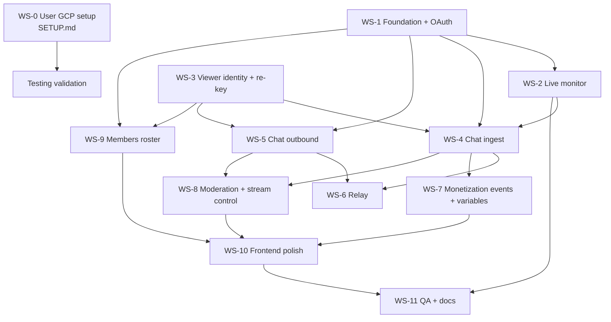

# Firebot × YouTube Integration — Build Plan

> **Single source of truth** for the fork adding native YouTube support to Firebot v5.
> Check off items as completed. Every workstream (WS) declares an **exclusive file
> ownership set** so parallel agents never write the same files.

## Status legend

- `[ ]` not started · `[~]` in progress · `[x]` done · `[!]` blocked (note why)
- Each WS header lists: **depends on**, **owns** (files that agent may write), **contract** (what others rely on).

## Ground rules for all agents

1. New code is **TypeScript**, styled per repo ESLint (`npm run lint` must pass; run `npx tsc --noEmit` for type sanity).
2. ALL YouTube code lives under `src/backend/integrations/builtin/youtube/` (unless a task explicitly says otherwise). Frontend additions live under `src/gui/app/` per-file ownership below.
3. **Never touch Twitch core files** except where a task explicitly lists them (dispatch refactors, compose box, chat menu gating).
4. YouTube module never imports `TwitchApi`. Communication between platform modules happens via the dispatch layer (WS-5) and exported EventEmitters only.
5. All YouTube backend logging: `LoggerCache.getLogger("YouTube")`.
6. Respect the **quota budget** in the invariants section — no polling loops without documented cost.
7. When a shared type is needed that doesn't exist yet, **don't create it silently** — check `# Contracts (WS-1 deliverable)` first; the contracts file owns shared types.

---

## Locked decisions (from planning session)

| # | Decision |
|---|---|
| D1 | Build as a **native integration** under `src/backend/integrations/builtin/youtube/` — not a second platform core, not a refactor of `AccountAccess`/`ConnectionManager` |
| D2 | **Two Google OAuth providers**: `youtube:streamer-account` + `youtube:bot-account`; bot account is a channel moderator |
| D3 | OAuth via existing `code`-flow machinery (`client-oauth2` → local HTTP callback `http://localhost:7472/api/v1/auth/callback`); Google params `access_type=offline&prompt=consent` embedded in authorizePath |
| D4 | Testing-mode consent screen (7-day refresh-token expiry accepted); production flip is a late checklist item |
| D5 | **Merged dashboard chat feed** (Twitch + YouTube in one feed), YT messages tagged with platform marker |
| D6 | **Cross-platform relay** (YT-bot relays Twitch→YT chat, Twitch-bot relays YT→Twitch): settings toggle (default **off**), only while *both* platforms live, per-minute cap (default 12), fixed `[Twitch] Name: message` / `[YT] Name: message` format, Twitch→YT **strips emote parts** |
| D7 | Command chat responses go to **both platforms** (Chat effect gains destination support), non-chat effects untouched |
| D8 | **Separate `youtube:*` event IDs** — no reuse of `twitch:*` event bindings |
| D9 | **Full viewer-DB re-key**: every viewer record `_id = "<platform>:<user_id>"` (`twitch:123`, `youtube:abc`), via a central identity helper; DB layers scope/unscope internally; all Twitch-facing surfaces keep carrying **raw** platform IDs; `FirebotChatMessage` gains `platform` field. No migration needed (fresh install), only a defensive sweep |
| D10 | Moderation parity for **delete/timeout/ban** (menu items work for YT messages); **mod/VIP grant + whisper are hidden** for YT messages (no API exists) |
| D11 | Title changes sync **both platforms** (`stream-title` effect + future manual edits); category stays Twitch-only (YT has no game taxonomy); polls deferred to roadmap |
| D12 | All monetization features built (member join/milestone/gifts, super chat/stickers, member roster best-effort w/ graceful 403) — events just won't fire until channel features are enabled |
| D13 | Live viewer panels ("Chat Users" list, Viewers page) are platform-aware; default variable set only |
| D14 | No cross-platform identity merging (same human, two records) — v2 problem |

---

## Key YouTube API facts (verified 2025-10, re-verify before relying)

- **Chat = REST polling.** `liveChatMessages.list` with `liveChatId`, `part=id,snippet,authorDetails`; every response has `nextPageToken`; wait `pollingIntervalMillis` (returned per response) before next call or expect `rateLimitExceeded`. `streamList` (server-streaming) exists as future upgrade — do NOT build on it for v1.
- **Send**: `liveChatMessages.insert` (costs **50 units/call**), `snippet.type=textMessageEvent`. YT display cap ~200 chars for regular chat.
- **Live detection**: `liveBroadcasts.list?mine=true&part=snippet,status,contentDetails` → `status.lifeCycleStatus` ∈ `live`/`testStarting`/`complete`; `snippet.liveChatId` + `id` (video id) cached. `offlineAt` on chat-list responses signals ended stream.
- **Moderation**: `liveChatMessages.delete` (owner/mod), `liveChatBans.insert` (`type: temporary` + `banDurationSeconds` 30s–86399s, or `type: permanent`), `liveChatBans.delete` (lift). Owner-or-mod OAuth required.
- **Per-message roles**: `authorDetails.isChatOwner / isChatModerator / isChatSponsor / isVerified` — no list API needed for role checks.
- **Monetization message types** arrive in the same chat feed: `newSponsorEvent`, `memberMilestoneChatEvent`, `membershipGiftingEvent`, `giftMembershipReceivedEvent`, `superChatEvent` (amountMicros/currency/tier/userComment), `superStickerEvent`. Roster: `members.list` + `membershipsLevels.list` (`youtube.channel-memberships.creator` scope, may 403 until YouTube approves the project post-enrollment).
- **Title update**: `liveBroadcasts.update` (or `videos.update`). YT "category" ≠ Twitch category (no game taxonomy).
- **Quota**: 10,000 units/day per project (fixed regardless of billing). List ops ≈1, inserts+moderation ≈50.

### Scopes

| Provider | Scopes |
|---|---|
| `youtube:streamer-account` | `https://www.googleapis.com/auth/youtube.force-ssl`, `https://www.googleapis.com/auth/youtube.channel-memberships.creator` |
| `youtube:bot-account` | `https://www.googleapis.com/auth/youtube.force-ssl` |

---

## Core invariants (non-negotiable, enforced in review)

1. **IDs**: `FirebotChatMessage.userId` and all event metadata `userId`s carry **raw platform IDs**. Scoping to `<platform>:<id>` happens **only** inside the DB layers via `viewers/viewer-identity.ts` (WS-3). One exception: YT-side DB calls must explicitly pass `platform: "youtube"`.
2. **Loop prevention** (relay + commands): all four logged-in identities (twitch streamer, twitch bot, yt streamer, yt bot) are filtered from every ingest path and from every relay source. Relay messages are authored by a bot account → `ignoreBot`-style command filtering must hold (verify command defaults during WS-4; add explicit relay-author filter belt-and-suspenders).
3. **Quota budget** per 24h (default 10k): live-check poll ≤1,440 (1/min while connected) + chat polls (~0.5–1 u/call at API-recommended interval, only while live) + inserts at 50 → budget a **bot-send cap of 80 messages/day** from effects by default (configurable), plus relay cap (D6). If tests blow the budget, tests are wrong.
4. **Chat reader lifecycle**: start only when broadcast is live; `nextPageToken` chain; `403 liveChatEnded`/`offlineAt` → clean stop + `stream-offline`; exponential backoff (max 3) on 5xx/network before giving up until next live-check.
5. **Token lifecycle**: refresh via `authManager.refreshTokenIfExpired()` before *every* connect call for BOTH accounts (integration-manager auto-refresh covers only the primary `auth` blob, not the bot token). On 401 after refresh → surface error to frontend + set integration disconnected.
6. `nextPageToken` persisted per session only (memory); a lost connection restarts history-free with fresh token + `maxResults=200`.

---

## Dependency graph



Sequential waves (minimum): **Wave 1** = WS-1 + WS-3 (parallel). **Wave 2** = WS-2 ∥ WS-4 ∥ WS-5 ∥ WS-7 ∥ WS-9. **Wave 3** = WS-6 ∥ WS-8. **Wave 4** = WS-10 → WS-11.

---

## Contracts (WS-1 deliverables — code against these, don't reinvent)

Agents building in parallel assume the following exist (defined first thing in WS-1, in
`src/backend/integrations/builtin/youtube/contracts.ts` + `youtube-api-client.ts`):

```ts
type YouTubePlatform = "youtube";

interface YouTubeChannelInfo { // from channels.list?part=snippet mine=true
    channelId: string;         // raw platform id (UC...)
    channelTitle: string;
    avatarUrl: string;
}

interface YouTubeAccountContext {
    providerId: string;              // "youtube:streamer-account" | "youtube:bot-account"
    channel: YouTubeChannelInfo;
    auth: AuthDetails;               // src/types/auth.ts
}

// Every YT message (chat or event) normalized to this before hitting Firebot core:
interface YouTubeIngestMessage {
    kind: "text" | "member-join" | "member-milestone" | "gift-membership"
        | "gift-membership-received" | "super-chat" | "super-sticker" | "banned";
    messageId: string;
    author: { channelId: string; displayName: string; avatarUrl: string;
              isOwner: boolean; isModerator: boolean; isSponsor: boolean };
    text?: string;
    publishedAt: string;             // ISO
    payload?: {                      // kind-specific
        superChatAmountDisplay?: string; superChatAmountMicros?: string;
        superChatCurrency?: string; superChatTier?: number;
        memberLevelName?: string; memberMonth?: number; isUpgrade?: boolean;
        giftCount?: number; gifterChannelId?: string;
    };
}
```

- `youtube-api-client.ts` — single REST façade. All methods take an explicit
  `account: "streamer" | "bot"` (token resolution + refresh inside). Methods (≥):
  `getMyChannel(account)`, `listOwnBroadcasts()`, `updateBroadcastTitle(videoId, title)`,
  `listChatMessages(liveChatId, pageToken?)`, `insertChatMessage(account, liveChatId, text)`,
  `deleteChatMessage(account, messageId)`, `banUser(account, liveChatId, channelId, {type, durationSecs})`,
  `unbanUser(account, bannedChannelId)`, `listChatModerators()` (via `listChatMessages` flags or `moderators.list` fallback),
  `listMembers()`, `listMembershipLevels()`, `getVideoLiveDetails(videoId)`. Returns typed results; throws `YouTubeApiError {kind: "quota"|"rate-limit"|"chat-ended"|"auth"|"not-found"|"other"}`.
- **Settings keys** (persisted via integration `settings-update`), pre-registered in WS-1 UI:
  `relayEnabled:false`, `relayMaxPerMinute:12`, `botAuth` (bot token storage), `botChannel` info, `linked:true/false`.
- **Emitters**: the integration exports `youtubeChatEvents: EventEmitter` with
  `"chat-message" (YouTubeIngestMessage)`, `"stream-online" (videoId,liveChatId)`,
  `"stream-offline"`, `"account-linked" (account)` — WS-2/4/6/8/9 subscribe, never import each other.

---

## WS-0 — User manual setup *(not agent work)*

- **Owns:** `SETUP.md` (user-maintained)
- [x] GCP project + OAuth client + consent-screen test users documented
- [x] Bot account → moderator documented
- [ ] *(user)* Execute SETUP.md §1–§3, paste `googleClientId`/`googleClientSecret` into `secrets.json`
- [ ] *(user, later)* Enrollment of Memberships (SETUP.md §5) — unblocks WS-9 real-data testing only

## WS-1 — Foundation: integration skeleton + Google OAuth (both accounts)

- **Depends on:** nothing (code-level)
- **Owns:** `src/backend/integrations/builtin/youtube/{youtube.js|youtube.ts, contracts.ts, youtube-api-client.ts, youtube-auth.ts, account-store.ts}`; `src/backend/integrations/builtin-integration-loader.js` (+1 line); `src/backend/secrets-manager.ts`; `src/gui/app/directives/modals/integrations/editIntegrationSettingsModal.js` (+template) for the new custom setting type; `secrets.template.json`
- **Contract out:** everything in the Contracts section; `secrets.googleClientId/googleClientSecret` read (NOT added to `expectedKeys` — missing keys must only *disable* the integration with a startup warning, never crash boot)

### Tasks
- [ ] Add `googleClientId`/`googleClientSecret` to `FirebotSecrets` interface (optional) + `secrets.template.json`
- [ ] Write `contracts.ts` with the types above + `YouTubeApiError` taxonomy
- [ ] Loader line: register `youtube/youtube` in `builtin-integration-loader.js`
- [ ] Integration definition: `id:"youtube", name:"YouTube", linkType:"auth", connectionToggle:true, configurable:true, authProviderDetails → streamer provider`
- [ ] Auth providers (mirroring `twitch-auth.ts` shape, but `type:"code"` like Streamlabs):
  - [ ] streamer: scopes `youtube.force-ssl` + `youtube.channel-memberships.creator`; `authorizeHost:"https://accounts.google.com"`, `authorizePath:"/o/oauth2/v2/auth?access_type=offline&prompt=consent"`, token `type:"code"`, `tokenHost:"https://oauth2.googleapis.com"`, `tokenPath:"/token"`, `redirectUriHost:"localhost"`, `autoRefreshToken: true`
  - [ ] bot: scope `youtube.force-ssl` only; registered directly via `authManager.registerAuthProvider` in `init()` (NOT as `definition.authProviderDetails` — avoids auto-link confusion in `integration-manager.js`)
  - [ ] Verify `client-oauth2` refresh works against Google (no `grant_type` surprises; scopes param tolerated)
- [ ] `auth-success` handling:
  - [ ] streamer → default integration-manager flow (link) + `link(linkData)` implementation: `getMyChannel("streamer")`, cache channel info, emit `settings-update`
  - [ ] bot → integration-module-local listener: `authManager.on("auth-success", providerId === "youtube:bot-account")` → store `botAuth`+`botChannel` via `settings-update` mechanism
- [ ] Bot link/unlink UI: custom setting type `"youtube-bot-auth"` rendered in integration settings modal — Link button → `shell.openExternal("http://localhost:{WebServerPort}/api/v1/auth?providerId=youtube:bot-account")` (mirror `startIntegrationLink`), status display (avatar+channel title), Unlink button
- [ ] `account-store.ts`: typed accessors `getStreamerAccount()/getBotAccount()` returning `{channel, auth}` or null; token-expiry checks
- [ ] `connect(integrationData)`: refresh-both-tokens, kick live monitor (WS-2 hook), set `connected=true` → emits framework `connected` event so Connection Panel tile works
- [ ] `disconnect()`: stop monitor + chat (emitter hook points), `connected=false`
- [ ] `unlink()`: clear all settings/auth (both accounts)
- [ ] Graceful degradation: missing secrets → log + define but don't crash; definition exposes `linked:false`

### Acceptance
- [ ] `npm run lint` + `npx tsc --noEmit` clean
- [ ] App boots with integration visible under Settings → Integrations, Link opens Google consent, both accounts can link, Connection Panel shows YouTube tile (disconnected state)
- [ ] Kill + re-approval: weekly-expired tokens are refreshed transparently on connect

## WS-2 — Live broadcast monitor + stream online/offline events

- **Depends on:** WS-1 (contracts + client)
- **Owns:** `src/backend/integrations/builtin/youtube/live-monitor.ts`, `triggers/stream-events.ts`
- **Data out:** `"stream-online" (videoId, liveChatId, concurrentViewers?, startedAt?)`, `"stream-offline"` events; `frontendCommunicator.send("youtube:stream-info-update", {...})` for dashboard display (consumed in WS-10)

### Tasks
- [ ] Poll loop (60s, only while integration connected): `listOwnBroadcasts()` → find `lifeCycleStatus === "live"` (accept `testStarting` as *pre-live* with no chat start) → cache `{videoId, liveChatId}`
- [ ] Edge: multiple broadcasts (`mine=true` returns all) → pick most recent by (`status.recordings`? use `snippet.publishedAt` latest with live status)
- [ ] Transition live→offline (`lifeCycleStatus complete` OR `liveChatEnded` API error OR `offlineAt` in chat-list response): stop reader, fire `stream-offline`
- [ ] `videos.list(id, part=liveStreamingDetails,statistics)` piggyback for `concurrentViewers` (1 unit, same 60s tick)
- [ ] `triggers/stream-events.ts`: fire `EventManager.triggerEvent("youtube", "stream-online"|"stream-offline", {username: channelTitle, userId: channelId, ...})`
- [ ] Hook points into WS-1: `connect()` starts monitor; disconnect stops
- [ ] Logging: every transition at info; poll errors at warn with error kind

### Acceptance
- [ ] With user's real channel: going live in YT Studio/OBS flips integration connected + fires both events (verify via Events test-fire + activity feed entry from WS-7 definitions)
- [ ] Ending stream stops the chat reader (WS-4 hook) cleanly, no loop spam

## WS-3 — Viewer identity + DB re-key (twitch:<id>, youtube:<id>) **[x] DONE**

- **Depends on:** nothing
- **Owns:** `src/backend/viewers/viewer-identity.ts` (new), `src/backend/viewers/viewer-database.ts`, `src/backend/database/currencyDatabase.js`, `src/types/chat.ts` (add `platform?` field ONLY — coordinate: WS-4 relies on this), `src/backend/roles/*.ts` **only if** lookups need scoping wrappers, `src/backend/viewers` type files as needed
- **Contract out (exact signatures implemented):**
    - `viewer-identity.ts`: `VIEWER_PLATFORMS = ["twitch","youtube"]`, `type ViewerPlatform`, `isViewerPlatform(value): value is ViewerPlatform`, `scopeViewerId(platform, rawId): string` (throws on unknown platform / empty id / already-scoped id), `parseViewerId(scopedId): { platform, rawId }` (throws on malformed), `safeParseViewerId(scopedId)` (same, returns null), `rawIdFromPlatform(platform, scopedId): string \| null`, `unscopeViewerId(scopedId): string` (pass-through), `inferViewerPlatformFromId(id): ViewerPlatform`
    - `viewer-database.ts` (returns "viewer \| null" for misses): `getViewerById(id)` (raw Twitch id **or** already-scoped id), `getViewerByUserId(legacyTwitchId)` (alias), `getViewerByScopedId(platform, rawId)`, `upsertYouTubeViewer(channelId, { displayName, username?, avatarUrl? }): Promise<FirebotViewer>` (returns stored record with scoped `_id = "youtube:<channelId>"`), `createOrUpdateYoutubeViewer(channelId, displayName, avatarUrl?)` (positional alias), `createNewViewer(viewer: NewFirebotViewer)` (legacy Twitch path; honors optional `NewFirebotViewer.platform`, defaults twitch; returns/sends RAW-id record for legacy compat)

### Tasks
- [x] `viewer-identity.ts`: `VIEWER_PLATFORMS`, `scopeViewerId`, `parseViewerId`, `rawIdFromPlatform`, plus non-throwing `safeParseViewerId`/`unscopeViewerId` and `inferViewerPlatformFromId` helpers + unit tests (42 tests)
- [x] `viewer-database.ts`: funnel ALL `_id` construction through scoping helper; `platform` field added to `FirebotViewer` + `NewFirebotViewer`; `getViewerByUsername` doc-commented as **Twitch-only — never call from YouTube code paths** (WS invariant #1)
- [x] New lookups: `getViewerByScopedId(platform, id)`; `getViewerByUserId(legacyTwitchId)` alias; `getViewerById` still accepts raw Twitch ids so existing call sites need zero edits (already-scoped ids pass through)
- [x] YT upsert path: `upsertYouTubeViewer(channelId, {displayName, username?, avatarUrl?})` — create-if-missing (platform:"youtube", twitch:false), update name/avatar otherwise, returns stored record (called by WS-4)
- [x] Currency DB: scoping at the `currencyDatabase.js` facade boundaries (`adjustCurrencyForUserById`, `getUserCurrencies`, `getUserCurrencyRank` scope raw ids, default twitch, optional trailing `platform` param); manager internals all use record `_id`s (audit-verified); Twitch increments unchanged (regression-tested)
- [x] Defensive sweep on startup: `applyLegacyPlatformSweep()` called from `connectViewerDatabase()` — records missing `platform` stamped by `_id` shape (`^UC[\w-]{20,}$` → youtube, else twitch); logs count at debug; unit-tested
- [x] Audit sweep: all `_id:`/`userId` DB touchpoints verified — every write/lookup flows through scoping or record `_id`s (3 out-of-write-set sites need follow-up, see notes)
- [x] Event/activity metadata untouched (raw IDs) — verified `event-manager.ts`/`command-runner.ts`/`events-router` consumers carry chat-message raw userIds; rank event inside viewer-database emits raw id
- [x] FirebotChatMessage: `platform?: "twitch" \| "youtube"` added (default absent = twitch); `userId` stays RAW

### Acceptance
- [x] Unit tests for scoping + upsert: 81 WS-3 tests green (viewer-identity 42, viewer-database 29 incl. currency-on-scoped-record + legacy-Twitch-unchanged regression, currencyDatabase 10); full `jest` run: all WS-3 suites green
- [~] Fresh profile: unit tests verify Twitch creation accrues under `twitch:<id>` (`twitch-calls-unchanged regression` in viewer-database.spec.ts); the literal manual fresh-profile GUI run stays for testing phase
- [x] Type check green across repo (`tsc --noEmit` exit 0; no consumer needed changes)

### WS-3 coordination notes (for WS-4/WS-7/WS-10/WS-11)
- **Do NOT build scoped ids by hand.** Use `viewer-identity` helpers. YouTube code: `viewerDatabase.upsertYouTubeViewer(channelId, {...})` / `getViewerByScopedId("youtube", channelId)`; NEVER `getViewerByUsername` (Twitch-only, filters `twitch: true`).
- **DB records carry scoped `_id`** (`twitch:<id>` / `youtube:<id>`); all user-facing/event/API surfaces keep RAW ids — outbound records from `createNewViewer`, viewers page, `getAllUsernamesWithIds`, frontend sends, and event metadata are unscoped automatically; `updateViewer`/`removeViewer`/`incrementDbField`/`updateDbCell` accept raw OR scoped ids.
- **Out-of-write-set follow-ups needed (found in audit, NOT edited here):**
    1. `src/backend/viewers/viewer-online-status-manager.ts` ~L109 `setChatViewerOnline`: `getViewerDb().updateAsync({ _id: viewer.id }, ...)` uses a RAW Twitch id from chat packets → misses the scoped record. Fix: fetch via `viewerDatabase.getViewerById(viewer.id)` and update by `viewer._id` (like `setChatViewerOffline` already does), or wrap with `scopeViewerId("twitch", viewer.id)`.
    2. `src/backend/effects/builtin/update-role.ts` ~L170: `user.id = viewer._id` (now scoped) feeds custom-role user lists keyed by RAW Twitch ids → membership mismatch. Fix: `user.id = unscopeViewerId(viewer._id)`.
    3. `src/backend/currency/currency-manager.ts` `adjustCurrencyForViewerById` re-resolves by USERNAME via Twitch-only `getViewerByUsername` → YouTube currency adjustments return false even when the id lookup succeeds (currency-manager is not WS-3-owned; WS-7 needs a platform-aware path).
- FYI: `viewers-api-controller.ts` JSON dump and `viewer-export-manager.ts` file exports expose scoped `_id`s (DB dumps — untouched, outside write set); GUI viewers page still shows raw ids by design (WS-10 polish if display wanted).
- Test infra added (WS-3, for everyone): `ts-jest` + `ts-node` + `@types/jest` devDeps; `jest.config.ts` now has a ts-jest transform + an `electron` module mapper (`tests/mocks/electron-mock.ts`, owned/extended by WS-1's agent). Caveat: jest's default `testMatch` treats every file under `__tests__/` as a suite — name fixtures/specs accordingly.

## WS-4 — YouTube chat ingest (read loop → commands + merged feed + roles)

- **Depends on:** WS-1 (contracts/client), WS-2 (liveChatId), WS-3 (viewer upsert + platform field)
- **Owns:** `src/backend/integrations/builtin/youtube/chat-ingest.ts`, `chat-message-mapper.ts`, viewer-list glue `src/backend/chat/active-user-handler.ts` (extension only)
- **Hook points (read-only):** `chatCommandHandler.handleChatMessage`, `FrontendChatManager.sendChatMessageToFrontend` — existing code, no edits unless acceptance fails

### Tasks
- [ ] Reader loop: on `stream-online`, paginate `listChatMessages` respecting `pollingIntervalMillis`; dedupe by `messageId` (in-memory LRU, restart-safe thanks to page token)
- [ ] `chat-message-mapper.ts`: map every `YouTubeIngestMessage`:
  - [ ] `textMessageEvent` → `FirebotChatMessage`: `platform:"youtube"`, parts (text + `mention` for `@word` tokens), `id: messageId`, `userId: author.channelId` (raw!), `username`, `userDisplayName`, `profilePicUrl` from authorDetails, roles `[broadcaster|mod|sub]` from flags, badges minimal
  - [ ] Non-text kinds → hand off to WS-7 emitter (no event triggering here)
- [ ] Viewer DB touchpoint (WS-3 API): `upsertYouTubeViewer` on message (throttle: only if >60s since last write for that user) + currency/view-time increments via existing accrual calls scoped to platform:"youtube"
- [ ] Feed → `FrontendChatManager.sendChatMessageToFrontend(msg)` (dashboard renders; platform badge is WS-10)
- [ ] Commands → `chatCommandHandler.handleChatMessage(msg)` **but skip if message author is one of the four logged-in identities** (loop prevention invariant #2); verify `ignoreBot` default via `CommandManager` (if not default-on, enforce here)
- [ ] Own-account self-filter: drop messages authored by yt-streamer or yt-bot channel IDs *after* feed display (they still show in dashboard — it IS the blended chat) — relay/command dedupe lives here
- [ ] Active users: register YT chatters into ActiveUserHandler with platform tag so Chat Users panel includes them (WS-10 renders category)
- [ ] Reconnect behavior: on reader crash/error-kind taxonomy (invariant #4): backoff, re-fetch liveChatId from monitor state, resume at latest token (skipping old messages is fine — log gap)

### Acceptance
- [ ] Real broadcast: YT messages appear in dashboard feed; `!dado` typed on YT runs the Twitch-configured command exactly once
- [ ] Sponsor/member message types do NOT render as chat text, and produce exactly one event each (WS-7 logs)
- [ ] Stream end → reader stops within one poll tick; no unhandled rejections in logs

## WS-5 — Chat outbound: dispatch layer, dual-platform responses, compose box

- **Depends on:** WS-1 (client), WS-3 (platform field)
- **Owns:** `src/backend/chat/platform-dispatch.ts` (new), `src/backend/effects/builtin/chat.ts`, `src/backend/streaming-platforms/twitch/api/resource/chat.ts` (delegate refactor only), `src/backend/chat/commands/chat-command-handler.ts` (2 failure-message call sites), YT sender module `src/backend/integrations/builtin/youtube/chat-sender.ts`
- **Owns (frontend):** `src/gui/app/services/chat-messages.service.js` (send payload gains no change if backend fans out — verify), `src/gui/app/templates/chat/_chat-messages.html` (chatter dropdown extension)

### Tasks
- [ ] `platform-dispatch.ts`: `sendChatMessage(message, {destination: "both"|"twitch"|"youtube", accountType, replyToMessageId?})` — Twitch side calls existing `TwitchApi.chat.sendChatMessage`; YouTube side calls `insertChatMessage(account, liveChatId)` via client; no-op + warn if that platform not connected/live
- [ ] YT sender: account choice per chatter setting (bot default when bot linked, streamer fallback); 200-char truncate with ellipsis; serialize sends (YT rejects concurrent inserts? — queue with 250ms gap); quota guard counter (budget 80/day default, log at 50/75/80, block after cap with warning)
- [ ] Chat effect (`effects/builtin/chat.ts`): add `destination` option (UI: dropdown Twitch/YouTube/Both; **default Both** per D7; whisper stays Twitch-only + tooltip); route through dispatch; strip `/me` handling for YT (no action messages — prepend asterisk removal: send raw text)
- [ ] Command failure messages (`chat-command-handler.ts` restriction-fail + invalid-subcmd): route through dispatch (both platforms)
- [ ] Twitch chat.ts API handler: keep behavior, but when `sendToBoth` setting true (new setting, default ON) → dispatch both. **Constraint:** single owner of the `chat:send-chat-message` listener — the YT side must NOT also subscribe
- [ ] Compose box chatter dropdown: options become `Both / Streamer / Bot` (default preserved per existing setting); YT copy uses `youtube` chatter setting internally
- [ ] Reply threading: YT has no replyToMessageId in v1 — ignore silently

### Acceptance
- [ ] From dashboard with both platforms connected: typed message appears in Twitch AND YT chat; chatter setting honored per platform
- [ ] Command triggered from either platform produces exactly one response per platform (no dupes when relay is also on — verify with WS-6 toggled)
- [ ] Quota guard blocks after cap with visible log + frontend error message

## WS-6 — Cross-platform chat relay

- **Depends on:** WS-4 (YT ingest events), WS-5 (dispatch), WS-1 settings keys (relayEnabled, relayMaxPerMinute)
- **Owns:** `src/backend/integrations/builtin/youtube/chat-relay.ts` (+ settings rendering additions live in WS-1's settings page — file coordination via WS-1 keys, no file edits here beyond its own module)

### Tasks
- [ ] Subscribe to Twitch chat-message EventEmitter (exported from `twitch-chat-listeners`) AND `youtubeChatEvents` — relay only messages not authored by any of the four logged-in identities
- [ ] Twitch→YT: join **text parts only** (emote/cheermote/3rd-party parts dropped per D6 — not converted), format `[Twitch] ${displayName}: ${text}`, truncate 200, send via `account:"bot"`, respect cap + budget counters (shares WS-5 daily budget accounting but separate cap)
- [ ] YT→Twitch: format `[YT] ${displayName}: ${text}`, send Twitch side via dispatch (`sendAsBot:true`)
- [ ] Gate: only while BOTH platforms live+connected; when relay disabled at runtime → unsubscribe cleanly
- [ ] Rate cap: sliding 60s window, drop silently beyond cap (log at debug), settings cap per side
- [ ] Relay markers: append `isRelay:true, sourcePlatform` to the FirebotChatMessage we *emit* from ingest for our OWN sent copies? — no: our copies never enter ingest (self-filter). Verify + document in code comment
- [ ] Dashboard visibility: relayed copies ARE shown (they're authored by bots — check `hideBotMessages` filter in `cms.chatFeedItems` pipeline; if it filters them, tag relayed items and adjust filter so only *Firebot-authored command responses* stay hidden — coordinate file ownership with WS-10 for that filter file)

### Acceptance
- [ ] Two browser sessions (Twitch + YT): messages flow both directions, no loops (watch ≥5 min), emotes stripped on Twitch→YT, `[Twitch]`/`[YT]` prefixes correct
- [ ] Toggle off mid-stream → relay stops immediately; cap prevents quota spikes (verify counter)

## WS-7 — Monetization events + variables (youtube event source)

- **Depends on:** WS-4 (ingest hands off non-text messages); can build against contracts + fixtures in parallel
- **Owns:** `src/backend/integrations/builtin/youtube/events/{index.ts, youtube-event-source.ts, events/*.ts}`, `src/backend/integrations/builtin/youtube/variables/{index.ts, *.ts}`

### Tasks
- [ ] Register event source `"youtube"` (mirror streamlabs pattern `isIntegration: true`): events with `manualMetadata` for test-firing + `activityFeed.getMessage`:
  - [ ] `stream-online` / `stream-offline` (metadata from WS-2)
  - [ ] `chat-message` (YT text messages as event payload — optional but cheap)
  - [ ] `member-join` (newSponsor), `member-milestone` (memberMonth, memberLevelName, userComment), `gift-membership` (gifter + giftMembershipsCount), `gift-membership-received` (recipient + levelName), `super-chat` / `super-sticker` (amountDisplayString, amountMicros→display, currency, tier, userComment, author channel id), `members-only-mode-started/ended` (cheap, from sponsorOnlyMode types)
- [ ] Manual metadata: plausible defaults (`username: "MemberMcGee"`, amount `$5.00`, etc.)
- [ ] Variables registered via `ReplaceVariableManager` (mirror `twitch/variables/index.ts` aggregation; register from this module's init):
  - [ ] `$youtubeViewerCount`, `$superChatAmount`, `$superChatCurrency`, `$superChatTier`, `$superChatMessage`, `$memberLevelName`, `$memberMonth`, `$memberIsUpgrade`, `$giftedMembershipCount`
  - [ ] Each with evaluator reading event data + sensible fallback null-when-not-YT-context; handler docs comment
- [ ] Wire ingest kinds → `EventManager.triggerEvent("youtube", id, payload)` — one place, map in `events/event-handler.ts`
- [ ] Activity feed entries render for all events (streamlabs-style icons)

### Acceptance
- [ ] Events UI shows "YouTube" source with all events; Test Fire produces correct activity-feed lines and effect triggers
- [ ] On a real stream w/ super chat: event fires with correct amount/currency (verify with own $5 super chat — or YT Studio test stream)

## WS-8 — Moderation parity + title/stream control

- **Depends on:** WS-1 (client), WS-4 (platform-aware messages in feed), WS-5 (optional chat confirmations)
- **Owns:** `src/backend/integrations/builtin/youtube/moderation.ts`, `stream-control.ts`; backend handler touchpoints: `src/backend/streaming-platforms/twitch/api/resource/moderation.ts` (dispatch-aware), frontend `src/gui/app/directives/chat/feed items/chat-message.js` (menu gating), Twitch title/game effects `src/backend/streaming-platforms/twitch/effects/{stream-title.ts, stream-game.ts}` (dual-target option)

### Tasks
- [ ] `moderation.ts`: `deleteMessage(messageId)`, `timeoutUser(channelId, seconds)`, `banUser(channelId)`, `unbanUser(channelId)` via client (owner account token; verify requester is owner — UI only exposes to streamer anyway)
- [ ] Rework `update-user-banned-status` handler → platform-aware (message context or explicit platform param from frontend)
- [ ] New frontend handlers: `youtube:delete-message`, `youtube:timeout-user`, `youtube:ban-user` (+unban) OR reuse generic names with platform payload — pick one, keep twitch handler delegating through `platform-dispatch`-style shim
- [ ] Chat context menu (`chat-message.js`): platform-aware action list — for `platform:"youtube"` show Delete/Timeout/Ban; **hide** Mod/Unmod, VIP/UnVIP, Whisper; timeout durations mapped (default 300s; YT range 30s–86399s clamp); ban confirm modal reused
- [ ] Slash commands: `/timeout`, `/ban` typed in dashboard compose while YT selected → route to YT moderation (chatter dropdown becomes destination-aware for mod commands) OR documented limitation (choose during implementation; prefer routing)
- [ ] Title: `stream-title` effect + `!settitle`-style manual button — add destination options (Twitch / YouTube / Both, default Both per D11); YT path → `updateBroadcastTitle` (only when live; else error message)
- [ ] Category: explicitly Twitch-only; add tooltip noting YT has no game taxonomy (D11)

### Acceptance
- [ ] Live with both streams: delete a YT message from the feed, timeout a YT user 300s, ban + unban — all visible on YouTube side, quota logged
- [ ] Menu on a YT message never shows mod/vip/whisper; Twitch messages unchanged
- [ ] Title update from command/effect lands on both platforms (verify in YT Studio + Twitch)

## WS-9 — Members roster (best-effort)

- **Depends on:** WS-1 (client), WS-3 (roster keyed per platform)
- **Owns:** `src/backend/integrations/builtin/youtube/members-roster.ts`; frontend additions for a "Members" row in Chat Users panel `src/gui/app/directives/chat/chat-user-category.js` (usage-level edit only) + chat template row

### Tasks
- [ ] `listMembers()` + `listMembershipLevels()` on connect (and every 15 min while live); graceful `403`/quota → disable roster, log once, set flag `membersApiAvailable:false`
- [ ] Cache roster (id/name/level); expose to chat mapping as an *additional* role source (sponsor flag from chat remains primary)
- [ ] Frontend: CHAT USERS panel gains "Members" category (YT members present in chat + roster), platform badge via WS-10 conventions

### Acceptance
- [ ] Module no-ops cleanly pre-enrollment (user isn't enrolled — acceptance is "does not error, logs availability state"); revisit when enrolled (SETUP.md §5)

## WS-10 — Frontend polish & platform awareness

- **Depends on:** WS-4 + WS-7 + WS-8 outputs to polish
- **Owns:** `src/gui/app/directives/chat/feed items/chat-message.js` (platform badge only — menu gating is WS-8), `src/gui/app/services/chat-messages.service.js` (feed filter tweaks if not done in WS-6), dashboard stream-info component (`src/gui/app/directives/misc/stream-info.component.js`) for YT status, Viewers page platform column/badge, settings → accounts page note pointing at YouTube integration
- [ ] Platform badge: small YT icon on messages with `platform==="youtube"` (use existing fa/youtube icon set)
- [ ] Chat Users panel: YouTube chatters listed (platform-tagged) via ActiveUserHandler data from WS-4
- [ ] Stream info: when YT live, show YT status + concurrent viewers (from `youtube:stream-info-update`) beside Twitch info
- [ ] Viewers page: platform column/badge, filter by platform
- [ ] Error surfacing: quota/limit errors → toast + notification entry, not silent
- [ ] Copy pass: integration description strings mention quota + both-account setup

### Acceptance
- [ ] Manual eyeball pass on merged feed with both streams live; no console errors; platform badges correct after relay traffic

## WS-11 — Validation, quota audit, documentation

- **Depends on:** everything
- **Owns:** `docs/youtube-integration.md` (new), updates to `SETUP.md` final sync, test fixtures `tests/youtube/*`
- [ ] Lint + `npx tsc --noEmit` + `npm test` full pass
- [ ] Quota log: run a scripted 15-min dual-platform session, record actual unit consumption vs. budget; adjust caps if over
- [ ] Manual QA script (documented in docs): link both accounts → weekly-expiry simulation (system clock +7d) → detect live → merged chat → commands both directions → responses both platforms → relay loop check → moderation → title sync → event test-fires
- [ ] Failure drills: revoke token mid-stream (re-auth path), kill network 60s (reader recovery), quota-exceeded simulation (mock)
- [ ] Consent-screen production flip: document exact steps + expected "unverified app" flow (from D4)
- [ ] README note in repo root tying to upstream merge strategy (fork tracking)

---

## Wave execution order (recommended)

| Wave | Work | Parallel agents | Blocked by |
|---|---|---|---|
| 1 | WS-1 + WS-3 | 2 (disjoint file sets) | — |
| 2 | WS-2, WS-4, WS-5, WS-7, WS-9 | 5 | Wave 1 contracts |
| 3 | WS-6, WS-8 | 2 | Wave 2 |
| 4 | WS-10 | 1 | Wave 3 |
| 5 | WS-11 | 1 (+user LIVE test) | Wave 4 + SETUP.md done |

## Roadmap (post-v1, explicitly out of scope now)

- YouTube live polls (create/read via pollDetails)
- Cross-platform identity merge (D14)
- `streamList` low-latency chat (replace polling)
- YouTube "category"/game metadata mapping once YouTube ever provides it
- YT subscriber-count variables (public count via `channels.list`, trivial add — slot into WS-7 if desired early)
- Production OAuth verification / quota increase request (SETUP.md §6)

---

*Last updated: after planning session (see conversation for decision rationale). Update checkboxes in-place; append discovered constraints to the invariants section rather than task lists.*